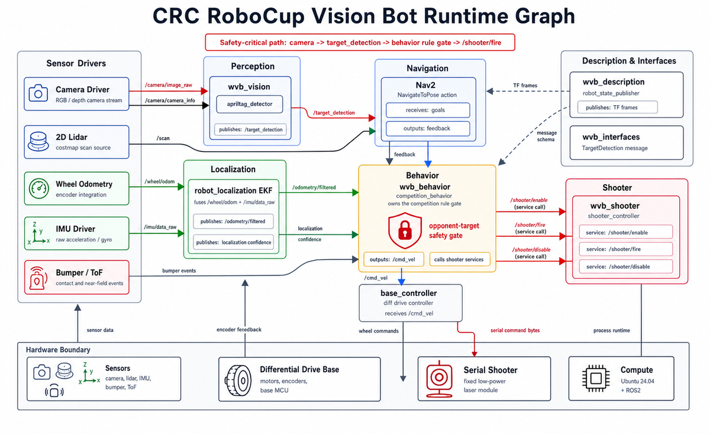

# Bohan Yu | Multi-Agent Robotics Portfolio

Research engineering for embodied and multi-agent systems: reproducible experiment contracts, simulation and replay pipelines, ROS 2 autonomy, and evaluation infrastructure.

**B.Eng. candidate in Computer Science and Technology, expected June 2027.** Focused on PhD and research-engineering opportunities in multi-agent learning, robotics systems, and embodied AI.

[Research projects](#selected-public-work) | [Coursework](#coursework-and-learning) | [Engineering practice](#local-verification) | [GitHub profile](https://github.com/yubohann)

<p align="center">
  <a href="robocup-cbg-wm/README.md">
    
  </a>
</p>

## Research Engineering Focus

| Area | What I build | Public evidence |
|---|---|---|
| Multi-agent learning | Explicit task, observation, action, and evaluation boundaries for partial-observation decision systems | Contracts, validators, replay artifacts, and documented failure boundaries |
| Embodied systems | ROS 2 interfaces, localization, perception gates, navigation, and simulator-to-runtime integration | TF and message contracts, Gazebo/Isaac simulation, testable safety gates |
| Research infrastructure | Configurable experiments, provenance, release checks, and reproducibility-oriented tooling | Run manifests, schema checks, local validators, and project-level tests |

## Selected Public Work

| Project | Public scope | Evidence boundary | Start here |
|---|---|---|---|
| [Rivermark](rivermark/) | Audit-first multi-sensor Search3D benchmark infrastructure | Public interfaces, validators, and release gates; public benchmark maturity is stated in the project docs | [Overview](rivermark/README.md) · [Code](rivermark/code/README.md) |
| [RoboCup CBG-WM](robocup-cbg-wm/) | Object-centric visual robotics, replay, and rule-gated evaluation | Project-level simulation/replay evidence; hardware and large-scale claims are explicitly scoped | [Overview](robocup-cbg-wm/README.md) · [Capability boundaries](robocup-cbg-wm/docs/capability_boundaries.md) |
| [Robocon MID-360 Autonomy Stack](robocon-mid360-autonomy-stack/) | Simulation-first ROS 2 localization and competition-autonomy stack | Public simulation, contracts, and test tooling; private bags, maps, and run archives remain out of tree | [Overview](robocon-mid360-autonomy-stack/README.md) |
| [AeroGate Graph](aerogate-graph/) | Modular 2D drone-racing simulator for graph route planning, formation control, and dynamic gate navigation | Public single- and multi-agent environments, deterministic smoke/reproduction CLI, tests, evaluation artifacts, and optional IsaacLab adapters | [Overview](aerogate-graph/README.md) · [Architecture](aerogate-graph/docs/ARCHITECTURE.md) · [Reproducibility](aerogate-graph/docs/REPRODUCIBILITY.md) |
| [FraudGraph ML Engineering](fraudgraph-ml-engineering/) | Reproducible graph-and-sequence fraud-detection engineering | Public training package, dataset adapters, experiment protocol, CLI, CI, manifest tooling, and tests | [Overview](fraudgraph-ml-engineering/README.md) · [Protocol](fraudgraph-ml-engineering/docs/research-protocol.md) · [Reproducibility](fraudgraph-ml-engineering/docs/reproducibility-checklist.md) |
| [ROS 2 Learning Notes](ros2-systematic-learning-notes/) | Structured ROS 2 engineering handbook | Educational reference material and PDF; not a claim of a deployed robotics system | [Overview](ros2-systematic-learning-notes/README.md) |

## Research Record

Each project identifies the evidence it contributes: public framework artifacts, simulation or replay artifacts, or hardware artifacts. This makes project scope traceable to the corresponding code, documentation, tests, and retained evidence rather than to a generic portfolio claim.

For navigation and project-specific verification entry points, see [Portfolio Guide](docs/PORTFOLIO_GUIDE.md).

## Coursework and Learning

| Project | Area | Stack |
|---|---|---|
| [Machine Learning Coursework](coursework/machine-learning/) | From-scratch classic algorithms, PCA/LDA, kNN, and ID3 | Python, NumPy, pandas, scikit-learn, matplotlib |
| [YOLO26 + VisDrone Detection](coursework/yolo26-visdrone-detection/) | Drone object detection, validation, and ONNX export | Ultralytics YOLO, VisDrone, ONNX |
| [Stream-Batch Lakehouse AI Portfolio](coursework/stream-batch-lakehouse-ai-portfolio/) | Lakehouse, streaming, recommender, and short-video review labs | Kafka, Flink, MinIO, Paimon, Spark |
| [Supermarket Management System](coursework/supermarket-management-system/) | Store-management application and engineering documentation | Flask, SQLAlchemy, SQLite, pytest |
| [Embodied AI Learning Roadmap](embodied-ai-learning-roadmap.md) | Twelve-week project-driven route from LLMs to robot learning | PyTorch, robot learning, evaluation, ROS 2 |

## Education and Experience

- **B.Eng. candidate, Computer Science and Technology** — Hubei University of Technology, expected June 2027. GPA: 86.7/100; overall merit rank: 1/33.
- **Algorithm Engineering Intern** — Wuhan Yawei Electronic Technology Co., Ltd., May-July 2026. Isaac Lab environments, PPO training, formation-aware observations, and obstacle-avoidance evaluation.
- **LiDAR and Perception Lead** — ROBOCON Robotics Team, 2023-2025. LiDAR-inertial localization, ROS 2 integration, navigation interfaces, and embedded-control handoff.
- **Team Lead** — Mathematical Modeling Laboratory, 2024-2025. Python, MATLAB, and linear-algebra training for student teams.

## Recognition

| Award | Level | Role |
|---|---|---|
| 2025 China Robot Competition and RoboCup China Open, third place / national first prize | National | Team leader |
| 24th ROBOCON Robot Basketball Competition, national second prize | National | LiDAR and perception lead |
| 24th ROBOCON Robot Basketball Shooting Competition, national second prize | National | LiDAR and perception lead |
| 24th ROBOCON Bionic Legged Robot Obstacle Challenge, national first prize | National | Team member |

## Local Verification

The repository includes a dependency-free check for its curated portfolio documents:

```bash
python tools/verify_portfolio.py
```

The check validates UTF-8 decoding, unresolved local Markdown and HTML links, selected image paths, and unresolved conflict markers in the portfolio entry documents. Project-specific tests and build commands remain documented inside each project.

## Attribution and Release Boundaries

Subprojects retain their own licenses, notices, and third-party attribution files. Vendored robotics components remain within their source boundaries. Private maps, bags, datasets, credentials, proprietary source code, and unverified performance claims are intentionally excluded.
