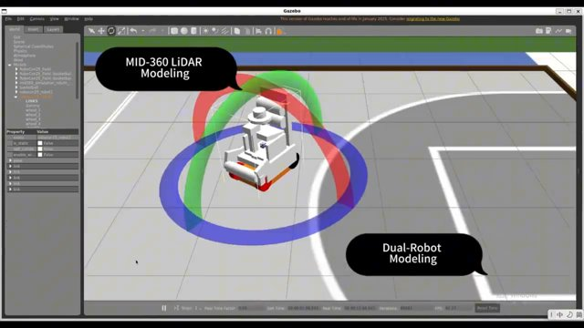
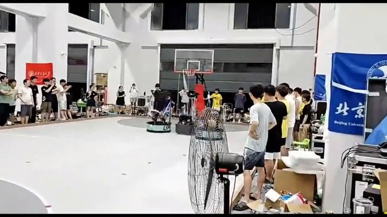
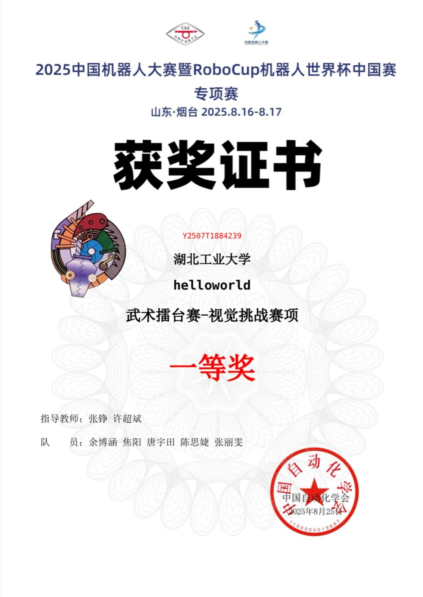
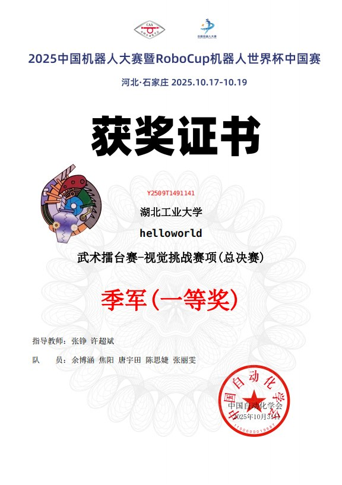
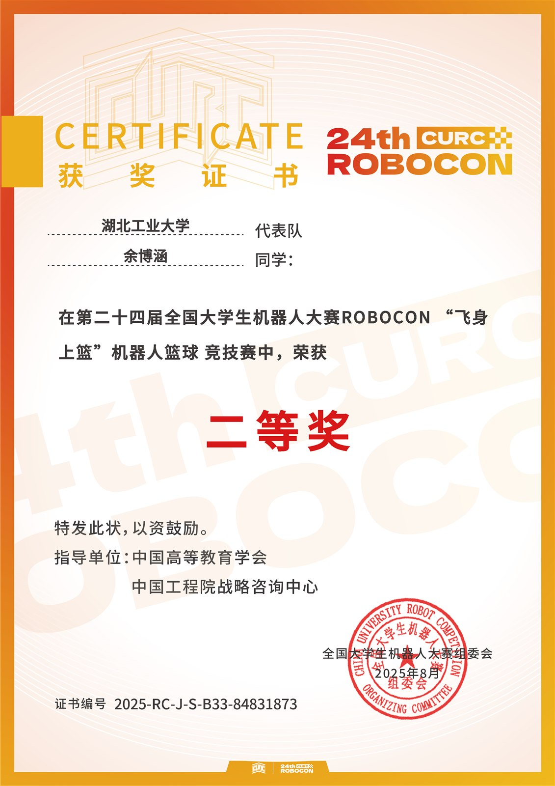
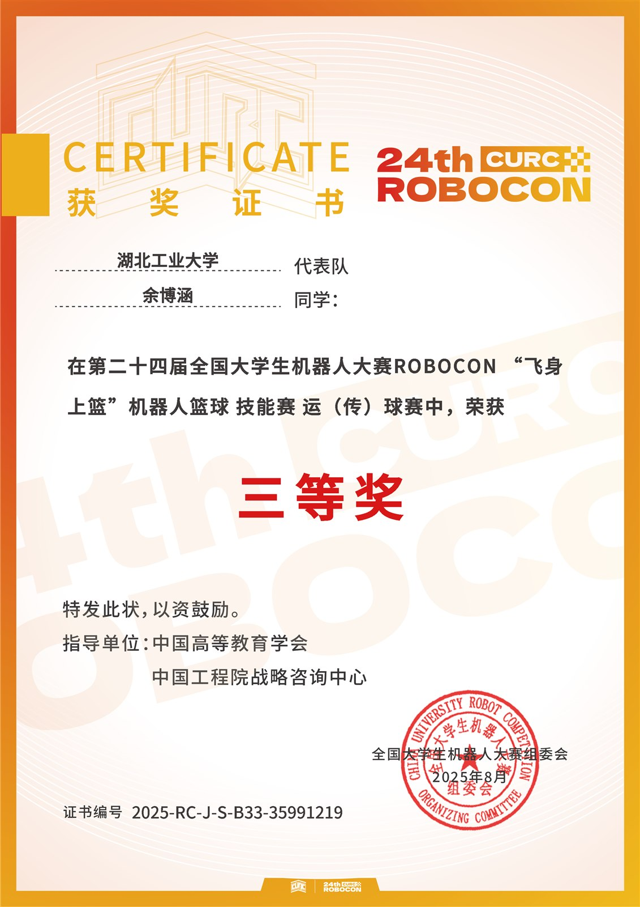
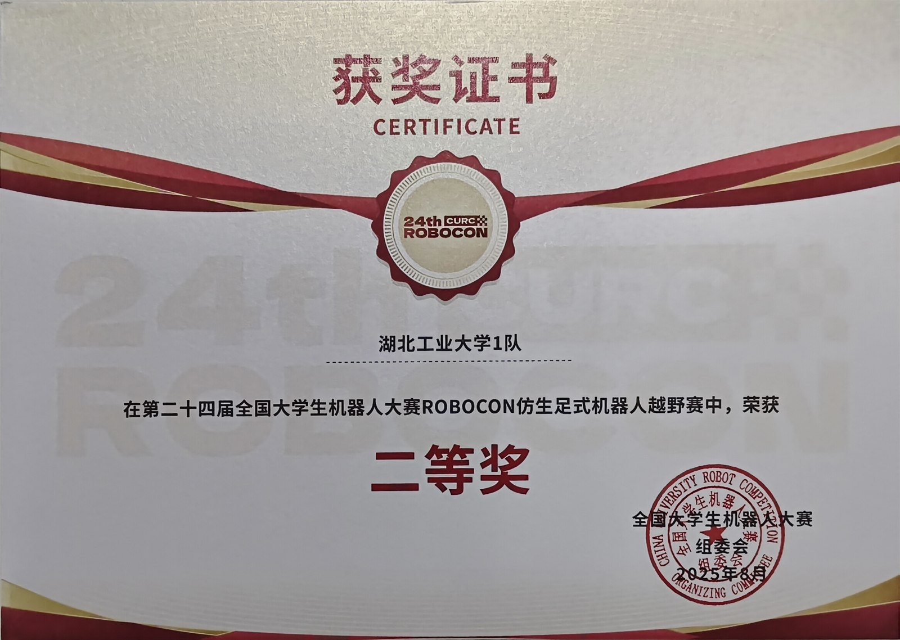
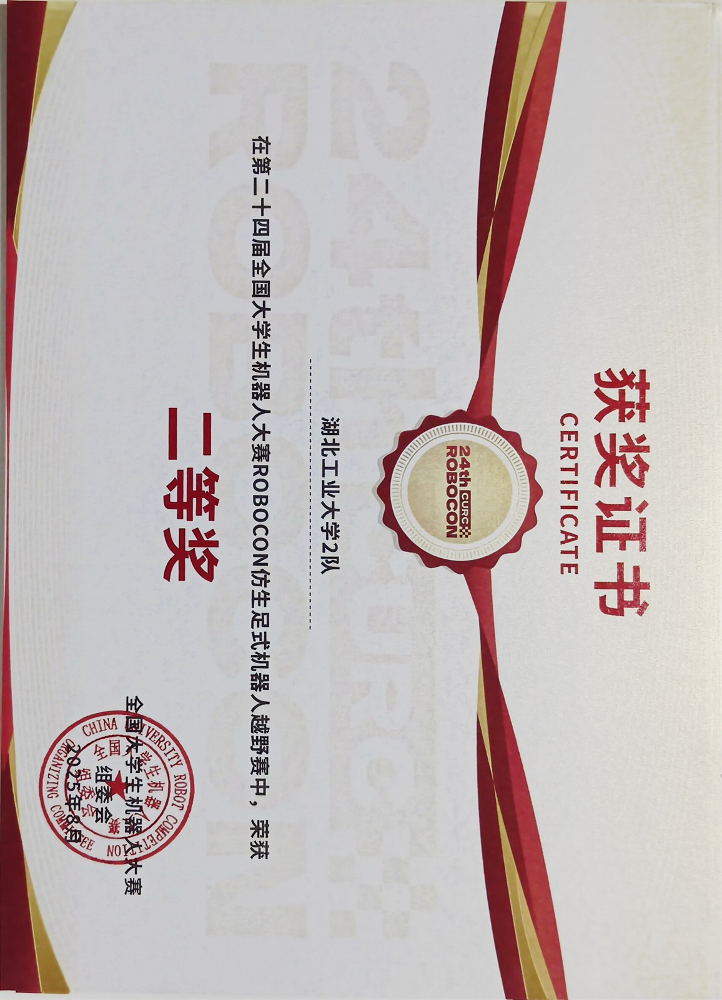
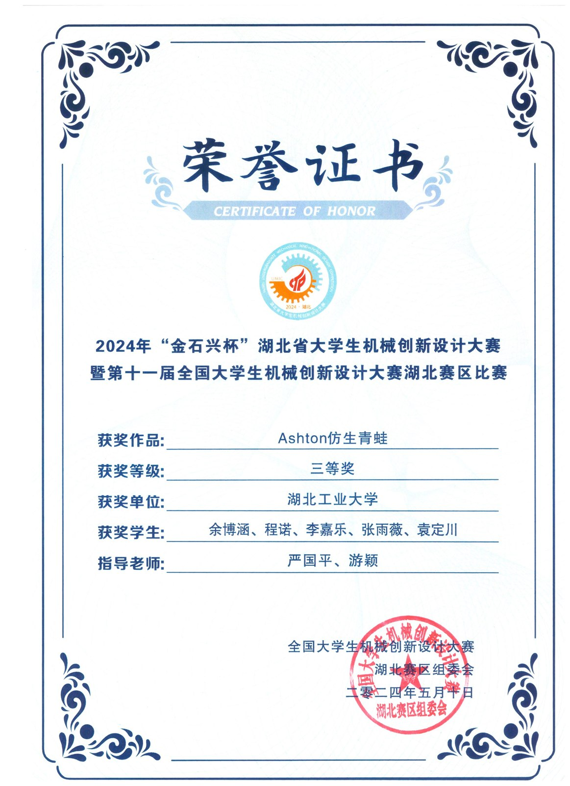
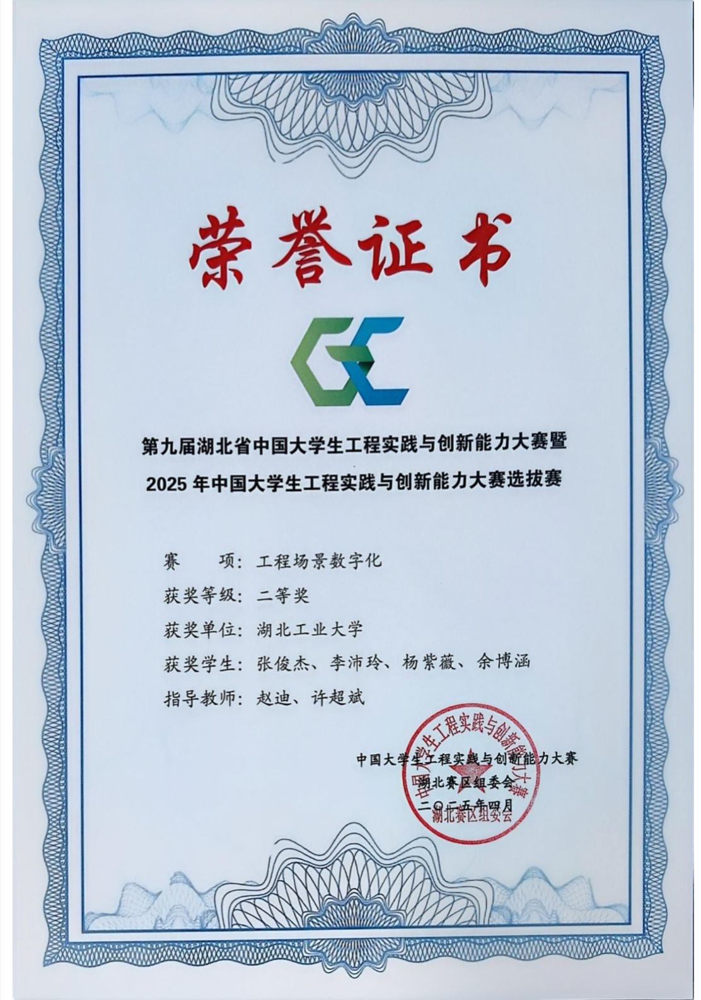

<h1 align="center">Bohan Yu</h1>

<b>Multi-Agent Robotics and Embodied AI</b>

  <a href="assets/cv/Bohan_Yu_CV.pdf">CV</a> &nbsp;|&nbsp;
  <a href="mailto:2311311120@hbut.edu.cn">Email</a> &nbsp;|&nbsp;
  <a href="#certificates">Certificates</a> &nbsp;|&nbsp;
  <a href="#videos">Videos</a> &nbsp;|&nbsp;
  <a href="#selected-work">Projects</a> &nbsp;|&nbsp;
  <a href="#experience-and-education">Experience</a> &nbsp;|&nbsp;
  <a href="#coursework">Coursework</a> &nbsp;|&nbsp;
  <a href="https://github.com/yubohann">GitHub</a> &nbsp;|&nbsp;
  <a href="README.zh-CN.md">简体中文</a>

---

**B.Eng. candidate in Computer Science and Technology, June 2027.** Research directions: multi-agent systems, visual-semantic navigation, and reinforcement learning; seeking internship and research-engineering roles in robotics and embodied AI.

---

## Videos

<table>
  <tr>
    <td align="center" width="50%"> <b>Robotics & Multi-Agent Systems Portfolio</b> (4 min)</td>
    <td align="center" width="50%"> <b>Robotics Team in Action</b> (3 min)</td>
  </tr>
</table>

---

## Certificates

<table>
  <tr>
    <td align="center" width="33%"> RoboCup China 2025, visual challenge, national first prize</td>
    <td align="center" width="33%"> RoboCup China 2025 finals, third place and national first prize</td>
    <td align="center" width="33%"> 24th ROBOCON basketball, national second prize</td>
  </tr>
  <tr>
    <td align="center" width="33%"> 24th ROBOCON shooting, national second prize</td>
    <td align="center" width="33%"> 24th ROBOCON passing, national third prize</td>
    <td align="center" width="33%"> 24th ROBOCON bionic legged, national second prize, team 1</td>
  </tr>
  <tr>
    <td align="center" width="33%"> 24th ROBOCON bionic legged, national first prize, team 2</td>
    <td align="center" width="33%"> Hubei mechanical innovation 2024, third prize</td>
    <td align="center" width="33%"> Hubei engineering practice 2025, second prize</td>
  </tr>
</table>

---

## Selected Work

| Project | Focus | Details |
|---|---|---|
| [Rivermark](rivermark/) | Multi-agent 3D search benchmark on native Isaac Sim, eight-drone captures. | [Overview](rivermark/README.md) |
| [RoboCup CBG-WM](robocup-cbg-wm/) | World models and risk-aware control for adversarial multi-robot navigation. | [Overview](robocup-cbg-wm/README.md), [Brief](robocup-cbg-wm/docs/admissions_project_brief.md) |
| [Robocon MID-360](robocon-mid360-autonomy-stack/) | Livox MID-360 and FAST-LIO2 localization with a ROS 2 competition stack. | [Overview](robocon-mid360-autonomy-stack/README.md) |
| [AeroCityBench](aerocity-bench/) | Procedural 3D multi-UAV search benchmark with public and private scoring splits. | [Overview](aerocity-bench/README.md) |
| [HM3D Realised-QD](hm3d-realised-qd/) | Quality-diversity and reinforcement learning for multi-UAV exploration in HM3D scenes. | [Overview](hm3d-realised-qd/README.md) |
| [AeroGate Graph](aerogate-graph/) | Graph reinforcement learning for dense gate traversal, single agent and 8-drone formation. | [Overview](aerogate-graph/README.md) |
| [FraudGraph](fraudgraph-ml-engineering/) | Graph-and-sequence fraud detection across eight financial datasets. | [Overview](fraudgraph-ml-engineering/README.md) |
| [ROS 2 Notes](ros2-systematic-learning-notes/) | A structured ROS 2 engineering handbook, 18 chapters. | [Overview](ros2-systematic-learning-notes/README.md) |

---

## Experience and Education

- **Independent Research Lead**, multi-robot cooperative exploration and target search, October 2025 to present. Designed and built the benchmark, graph reinforcement learning, world-model and quality-diversity projects in this portfolio, with a first-author manuscript in preparation on multi-robot exploration and geometry-constrained semantic allocation.
- **B.Eng. candidate in Computer Science and Technology**, Hubei University of Technology, June 2027. GPA 86.7 out of 100, merit rank 1 of 33.
- **Algorithm Engineering Intern**, Wuhan Yawei Electronic Technology Co., Ltd., May to July 2026. Isaac Lab environments, PPO training, formation-aware observations and obstacle-avoidance experiments.
- **LiDAR and Perception Lead**, ROBOCON Robotics Team, 2023 to 2025. LiDAR-inertial localization, ROS 2 integration, navigation interfaces and embedded-control handoff.
- **Team Lead**, Mathematical Modeling Laboratory, 2024 to 2025. Python, MATLAB and linear-algebra training for student teams.

---

## Toolbox

| Area | Tools |
|---|---|
| Languages | Python, C++, MATLAB |
| Learning | PyTorch, Stable-Baselines3, PPO, SAC, MAP-Elites |
| Robotics | ROS 2, Isaac Sim and Isaac Lab, PhysX, Habitat-Sim and Habitat-Lab, Gazebo, Nav2, MoveIt 2 |
| Perception | LiDAR, RGB-D, IMU, YOLO, AprilTag, PCL |
| Infrastructure | Linux, Docker, Git, CI |

---

## Coursework

| Project | Focus | Stack |
|---|---|---|
| [Machine Learning](coursework/machine-learning/) | Ten classical algorithms from scratch, plus a PCA, LDA, kNN and ID3 pipeline | Python, NumPy, pandas, scikit-learn |
| [YOLO26 + VisDrone](coursework/yolo26-visdrone-detection/) | Drone detection from subset preparation to training, validation and ONNX export | Ultralytics YOLO, VisDrone, ONNX |
| [Streaming Lakehouse Labs](coursework/streaming-lakehouse/) | Lakehouse, seven streaming challenges, recommender and short-video review labs | Kafka, Flink, MinIO, Paimon, Spark |
| [Supermarket System](coursework/supermarket-management-system/) | Flask store-management application with tests and defense material | Flask, SQLAlchemy, SQLite, pytest |
| [Embodied AI Roadmap](embodied-ai-learning-roadmap.md) | Twelve-week project-driven route from LLMs to robot learning | PyTorch, robot learning, ROS 2 |

---

Contact 2311311120@hbut.edu.cn. Navigation and local checks live in the [Portfolio Guide](docs/PORTFOLIO_GUIDE.md) and [Integrated Project Sources](docs/INTEGRATED_PROJECTS.md). Each subproject ships its own license and third-party notices.
