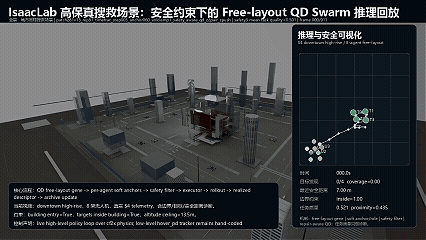
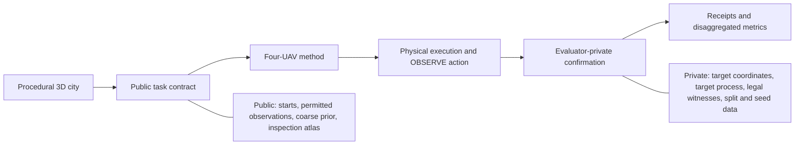

# AeroCityBench

<p align="center">
  
  
</p>

> An open, physics-grounded benchmark for multi-UAV 3D target search under urban topology, target-process, and fleet-resilience shifts.

AeroCityBench studies a simple but consequential question, **does covering more space make a multi-UAV system better at finding targets?** In a city, the answer is often no. A vehicle may fly past a building and miss its roof, inspect the wrong facade, lose line of sight behind geometry, or move too quickly and miss the valid observation window. AeroCityBench makes these distinctions measurable.

The benchmark combines procedurally generated 3D cities, a public task contract, scorer-private target truth, and a physically constrained execution interface. It compares planning and learning methods with target coordinates kept private and confirmation tied to a legal observation.

> **Research prototype.** `v0.2.0.dev0` is a pilot build. The generator, contracts, audit tooling, adapters, and calibration infrastructure are implemented. Formal blind scoring and score-eligible native episodes are in progress. See [Current status](#current-status) before using or citing results.

## The Research Question

Most exploration benchmarks reward coverage, map completion, or distance traveled. Those signals capture coverage behavior. Target confirmation additionally requires a legal observation.

In AeroCityBench, a target is confirmed only when an scorer accepts a real observation under the task contract, range, field of view, line of sight, surface-facing direction, dwell time, source-observation freshness, pose stability, and safety conditions must all hold. The benchmark can therefore test when coverage and target-search quality agree, when they diverge, and why.

## Benchmark Design



### Public Task, Private Truth

Methods receive only the information that an executable system is allowed to use. The scorer retains the information that would otherwise turn search into a coordinate-visitation problem.

| Available to a method | Retained by the scorer |
| --- | --- |
| Vehicle state, permitted sensor observations, time and energy budget | Target coordinates, counts, labels, and generating process |
| Public starts, communication messages, and a target-agnostic coarse prior | Legal observation witnesses and confirmation decisions |
| The G2-I inspection atlas, derived from geometry alone | Test split, city family, and generation seeds |

The public inspection atlas identifies *what kinds of structures can be inspected*, roofs, facades, entrances, and rubble. Target-bearing structures remain private. Recursive leakage checks block private target, witness, scorer, split, and seed fields in public projections.

### Task Tracks

- **G2-I geometry search** is the primary research track. It scores target confirmation through a target-agnostic inspection atlas and a scorer-checked observation contract.
- **G1-U exploration** is a historical coverage diagnostic. It may still be selected explicitly, and its score reports separately from G2-I.
- **Perception search** is reserved for a separately ranked detector-and-search track. RGB-D is available for mapping, avoidance, and visual policies, and geometric ranking uses geometry only.

### Controlled Generalization

The release contract varies city topology, spatial scale, target process, spawn condition, and fleet condition while keeping the execution and information scopes fixed. The intended scoring separates the following.

- in-distribution search from topology, scale, and target-process shifts.
- spatial coverage from confirmed-target recall over time.
- search quality from collision, clearance, energy, communication, and compute-budget failures.
- capacity loss from the coordination cost of fleet disruption.

## What Is Measured

The primary outcome is **confirmed-target recall over execution time**, reported together with final recall and time-to-confirmation. Safety, resources, and coordination are reported separately as first-class metrics.

- **Search:** confirmed recall, recall-over-time, first-confirmation time, height and support-surface breakdowns, and coverage-to-search gaps.
- **Safety:** static and inter-UAV collisions, clearance interventions, out-of-bounds events, and safe return-home closure.
- **Resources:** path length, energy use, planning latency, deadline misses, and simulated execution time.
- **Coordination:** redundant inspection, workload balance, communication state, and reallocation after fleet changes.

## Included in This Repository

- A constrained procedural city generator with versioned release configurations and open-asset policy checks.
- Public and private task projections, JSON schemas, content hashes, and release validation.
- A G2-I inspection-atlas compiler that derives candidate inspection regions from geometry alone, keeping target sampling and scorer data separate.
- Scorer contracts for evidence-bound `OBSERVE` actions and private target confirmation.
- Baseline and external-process adapter scopes, plus CPU and native-runtime preflight tools.
- Tests, source-lock checks, asset-provenance checks, and development audit utilities.

The repository ships repository-authored code and documentation. NVIDIA, Nucleus, Isaac Sim, and local scorer-private assets come from your own installation. Direct Isaac workflows require a local IsaacLab installation and an explicitly configured asset root.

## Current Status

**Implemented and auditable**

- Procedural city generation, task schemas, public and private information scopes, release validation, and open-asset licensing checks.
- G2-I public inspection-atlas compilation, recursive leakage checks, scorer-side observation receipts, and method adapter contracts.
- Development-grade CPU tests, quality-gate tooling, and native-runtime capability and preflight receipts.

**Planned milestones**

- A formal public leaderboard, an independently held blind test partition, and a score-eligible native multi-UAV episode suite.
- A completed external-method comparison, a peer-reviewed benchmark conclusion, and a real-world disaster-distribution model.
- PyPI publication and redistributable NVIDIA and Isaac assets.

Native and L0 calibration artifacts are engineering evidence. Formal benchmark scores come from results marked `formal_score_eligible=true`.

## Quick Start

Python 3.11+ is required. Install the development dependencies and run focused contract tests first.

```powershell
python -m pip install -e ".[dev]"
python -m pytest tests/test_public_boundary.py tests/test_inspection_atlas.py tests/test_ordinary_v3.py -q
```

Building a local development release also requires a verified open-asset bundle and a writable output directory.

```powershell
$env:PYTHONPATH = (Resolve-Path .\src)
$assetRoot = (Resolve-Path $env:AEROCITY_ASSET_ROOT)
$outputRoot = Join-Path $env:AEROCITY_OUTPUT_ROOT "ordinary-v1-mini"

python -m aerocity_bench build --release .\configs\releases\ordinary-v1-mini.json `
  --asset-root $assetRoot `
  --output $outputRoot `
  --task-track G2-I `
  --allow-uncommitted-development
python -m aerocity_bench validate $outputRoot
```

Use `aerocity-bench --help` to inspect the installed CLI. On this Windows host, run integration paths as bounded, host-guarded jobs, since several of them intentionally launch child Python or Isaac processes.

## Repository Layout

```text
src/aerocity_bench/   generator, task contracts, evaluator, atlas, runtime, and adapters
configs/              versioned release and experiment configurations
schemas/              public/private artifact schemas
tests/                contract, leakage, generator, and runtime-preflight tests
tools/                validation, audit, capture, and focused experiment entry points
docs/                 research scope, execution contracts, and development records
assets/registry/      source and license policy for redistributable assets
```

## Scope

AeroCityBench is a research instrument for controlled 3D multi-UAV search. It provides a falsifiable setting for asking whether a method's coverage behavior survives occlusion, viewpoint constraints, target-process shift, and physical execution requirements.

## License

Repository-authored code and documentation are released under the terms in [LICENSE](LICENSE). Third-party engines, assets, and scorer-private materials keep their own terms. The repository bundles the assets explicitly listed in the asset registry.
