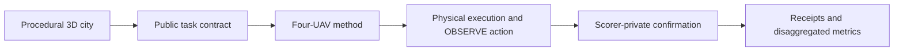

# AeroCityBench

<p align="center">
  
  
</p>

**An open, physics-grounded benchmark for multi-UAV 3D target search under urban topology, target-process and fleet-resilience shifts.**

Coverage is the standard proxy for search quality, and it breaks in cities. A quadrotor can pass a building and miss the roof, inspect the wrong facade, lose line of sight behind geometry, or cross the observation window too fast to score. AeroCityBench turns those cases into a measurable task: procedurally generated 3D cities, a public task contract, scorer-private target truth, and confirmation that requires a legal observation in flight.

**Status.** `v0.2.0.dev0` pilot. Generator, contracts, scorer, audit tooling and calibration infrastructure are implemented. Formal blind scoring opens after the validation gates in [docs/research-notes.md](docs/research-notes.md).

## What It Tests

The benchmark asks whether covering more space turns into finding more targets. A target scores only when the scorer accepts one real observation.



An OBSERVE must satisfy range, field of view, facing, line of sight, allowed surface side, dwell time, freshness, pose stability, clearance and runtime safety, with unique counting and a receipt bound to the real sensor frame.

| Available to a method | Retained by the scorer |
| --- | --- |
| Vehicle state, permitted sensors, time and energy budget | Target coordinates, counts, labels and generating process |
| Public starts, communication messages, target-agnostic coarse prior | Legal observation witnesses and confirmation decisions |
| The G2-I inspection atlas, derived from geometry alone | Test split, city family and generation seeds |

## Inside the Benchmark

- A constrained procedural city generator with versioned release configs and open-asset policy checks.
- Public and private task projections, JSON schemas, content hashes and release validation.
- A G2-I inspection atlas compiled from geometry alone, with recursive leakage probes.
- Scorer contracts for evidence-bound `OBSERVE` actions and private confirmation.
- Baseline adapters plus CPU and native preflight tools for external methods.
- Contract, integrity, host-guard and quality-gate tests that run on CPU.

## Verified So Far

Development-grade evidence from the current pilot. Formal scores come only from frozen records marked `formal_score_eligible=true`.

- Three-ancestor, four-UAV CF2X and PhysX calibration panel with safe closure, full return and an L0 to L1 rank correlation of 1.0.
- L2 visual review batches passed at a frozen 960x640 profile across training, calibration and validation cities.
- Twelve development cities passed static geometry, context and full-episode admission review.
- The CC0 mini asset core closed with 32 USD layers, zero remote references and zero unresolved paths.
- The mission-sector certificate recomputes flight, dwell, climb and reserve bounds from the public assignment and fails closed on any mismatch.

## Quick Start

Python 3.11 or newer.

```powershell
python -m pip install -e ".[dev]"
python -m pytest tests/test_public_boundary.py tests/test_inspection_atlas.py tests/test_ordinary_v3.py -q
```

Building a local development release needs a verified open-asset bundle and a writable output directory.

```powershell
$env:PYTHONPATH = (Resolve-Path .\src)
$assetRoot = (Resolve-Path $env:AEROCITY_ASSET_ROOT)
$outputRoot = Join-Path $env:AEROCITY_OUTPUT_ROOT "ordinary-v1-mini"

python -m aerocity_bench build --release .\configs\releases\ordinary-v1-mini.json `
  --asset-root $assetRoot --output $outputRoot --task-track G2-I --allow-uncommitted-development
python -m aerocity_bench validate $outputRoot
```

More paths, including native and external adapters, live in the [run guide](docs/run-guide.md).

## Documentation

- [Benchmark design](docs/benchmark-design.md), the task, confirmation contract, generation, splits and metrics.
- [Research notes](docs/research-notes.md), questions, dated design decisions, validation gates and evidence discipline.
- [Run guide](docs/run-guide.md), install, tests, builds and adapter entry points.

## License

Repository-authored code and documentation follow [LICENSE](LICENSE). Third-party engines and assets keep their own terms, listed in the asset registry.
