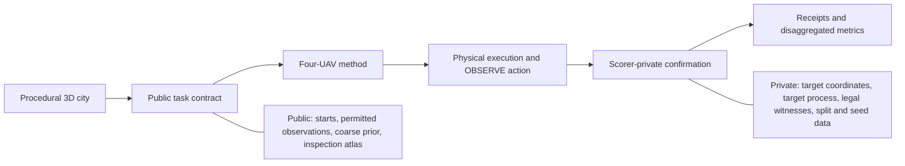
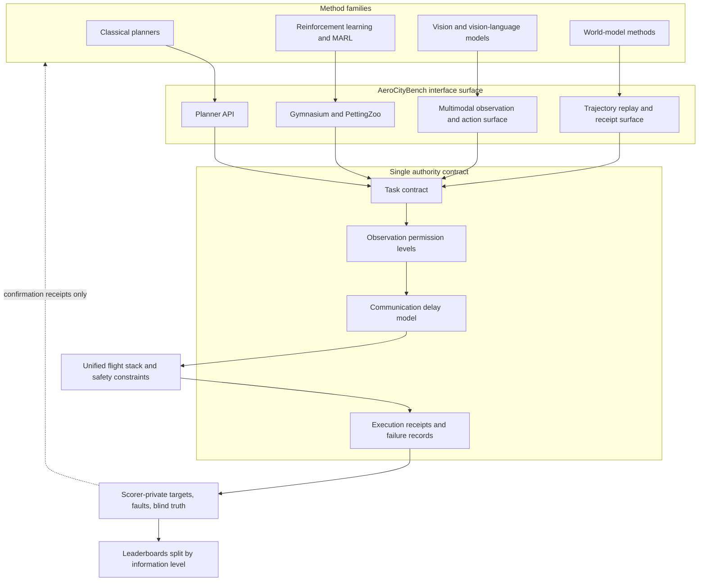

# Benchmark Design

AeroCityBench scores multi-UAV target search in cities. Coverage tells you where a fleet has been. Confirmed recall tells you what it actually found once occlusion, viewpoint, dwell time and physics enter the picture. The benchmark measures both on the same run, and keeps target truth on the scorer side.

The lead question: **does a method that covers more space also find more targets?** Most exploration benchmarks reward coverage, map completion or distance traveled, and those signals say little about whether a rooftop, facade or rubble target was ever legally observed. AeroCityBench makes the difference measurable.

## Public Task and Private Truth

| Available to a method | Retained by the scorer |
| --- | --- |
| Vehicle state, permitted sensor observations, time and energy budget | Target coordinates, counts, labels, and generating process |
| Public starts, communication messages, and a target-agnostic coarse prior | Legal observation witnesses and confirmation decisions |
| The G2I inspection atlas, derived from geometry alone | Test split, city family, and generation seeds |

Publishing target coordinates would reduce search to visiting known points. The scorer holds the answer sheet, and a method earns confirmation only through an observation it can actually produce in flight.



## Method Interface

Every entry point runs through one versioned, transport-neutral contract. Method families plug in at the top, and the flight stack below enforces the same safety and budget limits for everyone.



## Confirmation Contract

A target counts when the scorer accepts one real observation under the task contract. An OBSERVE action must satisfy range, field of view, facing direction, line of sight, the allowed surface side, dwell time, source-observation freshness, pose stability, clearance and runtime safety, with unique counting and a receipt bound to the actual sensor frame.

Attempts that fail a condition earn nothing. Flying through a wall, claiming a front target from the rear, calling a roof target from below, guessing a coordinate, reusing a stale frame, or reporting the same target twice all fail by construction. This is what separates a coverage footprint from an inspection.

## Task Tracks

- **G2I geometry search** is the main track. It scores confirmation through a target-agnostic inspection atlas and the observation contract above.
- **G1-U exploration** is a retired coverage diagnostic from the pilot design. It stays selectable for reference, and its numbers report separately from G2I.
- **Perception search** is reserved for a separately ranked detection-and-search track. RGB-D is allowed for mapping and visual policies, while geometric ranking uses geometry alone.

## City Generation

Cities come from a constrained procedural grammar:

```text
road graph -> blocks and parcels -> building components -> roof equipment and obstacles
-> rubble and road blockages -> flyable-space mesh -> open-license assets
-> visual and collision scene compile -> hidden target task
```

Every map passes density, connectivity, flyable-space, occlusion, target-opportunity and near-duplicate checks before it can enter a release. The generator varies map size, street width, block connectivity, building mix, courtyard and setback geometry, takeoff zones and fleet parameters.

## Target Processes

Targets sit on real support surfaces: rooftops, legal facade markers, entrances, rubble edges, and observation zones at different heights. Three processes drive the science:

- **Uniform surface** samples by legal surface area, so dense candidate regions carry no extra weight.
- **Clustered** concentrates targets on some buildings, blocks or heights to test behavior around hot spots.
- **Height-stratified** shifts the mix of low, mid, high and super-high targets to probe vertical search.

Every target carries verifiable evidence: coordinates, owning structure, support surface, surface normal, allowed observation directions, at least one legal observation pose, reachability, occlusion state, spatial spacing, visible solid angle and minimum confirmation cost.

## Splits

Data splits are isolated by city generation ancestor, so no layout ever crosses a train and test drawer:

- training cities for learning and parameter fits.
- validation cities with unseen ancestors for model selection.
- an in-distribution test set with fresh layouts and ancestors.
- a topology out-of-distribution set with unseen road connectivity and building combinations.
- a target-process out-of-distribution set that keeps geometry fixed and moves only the target law.
- a scale out-of-distribution set with larger or structurally harder cities.
- paired fleet-resilience sets with and without injected failures.

Formal split identity, target truth and failure truth stay with the scorer.

## Fleet and Resilience

The core search fleet is four UAVs. Scale runs use two, four and eight, and resilience starts at eight. Above twelve enters stress testing only after throughput and communication gates pass.

Resilience follows a paired design. The same mission runs with a full fleet, with a mid-flight loss of one or two vehicles, with a reduced fleet from takeoff, and against a centralized diagnosis upper bound that knows the failure truth. That separates raw capacity loss from late detection, slow reallocation, network splits, duplicate work and secondary collisions.

```text
resilience loss = area under confirmed-recall curve with a full fleet
                - area under confirmed-recall curve under fleet degradation
```

## Metrics

The primary outcome is **confirmed-target recall over execution time**, reported with final recall and time-to-confirmation. Safety, resource and coordination signals report separately and keep their raw components.

- Search. confirmed recall, recall over time, first confirmation time, height and support-surface breakdowns, coverage-to-search gap.
- Safety. collisions with structures and between UAVs, minimum clearance, out-of-bounds events, safe-return closure.
- Resources. path length, energy, cost per confirmed target, simulation time, planning latency and deadline misses.
- Coordination. duplicate inspection, workload balance, communication volume, stale messages, task reallocation after fleet changes.

## Compatibility

The benchmark anticipates classical 2D coverage, volumetric scanning, frontier methods, partition and market-based allocation, 3D exploration planners, independent RL and MARL, graph-communication methods, and centralized diagnostic upper bounds.

Each method declares its information permission, action permission, communication budget, training budget and runtime budget. The formal main board freezes one geometry-search regime for a fair primary ranking, and other information regimes run as separate compatible boards.

## Physical Consistency

One geometry authority drives the visual mesh, collision mesh, depth observations, occlusion checks, flyable space, target support surfaces and scorer ray tests. A wall that renders must exist in the collision model, and a ray that clears in the scorer must clear in physics. Base geometry can stay simple, but every consumer reads the same source.
