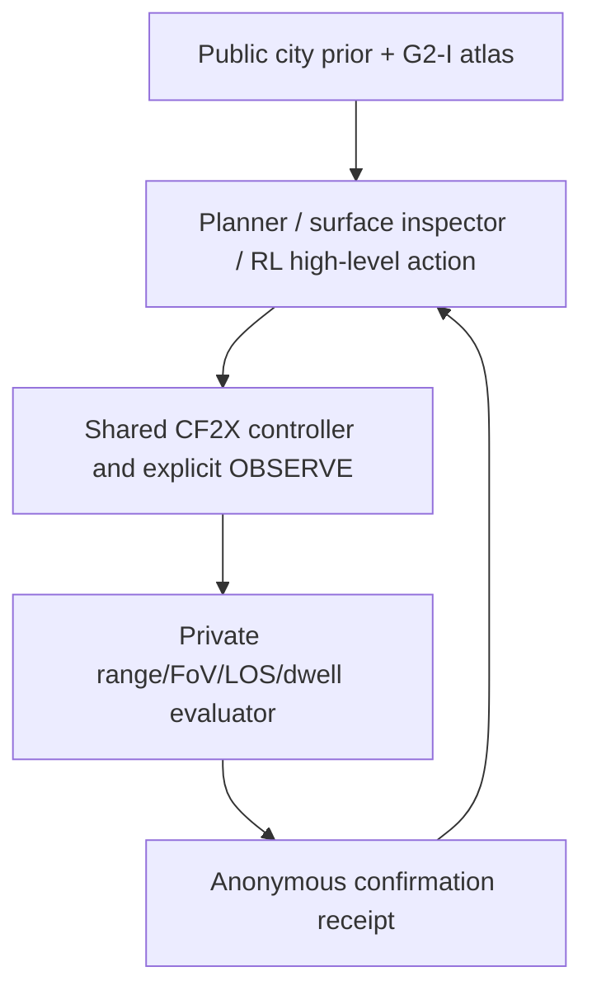

# G2-I Task Migration, Experiment Execution, and Reuse Plan

Status, `ACTIVE / STRICT G2-I L0 CONTRACT + MISSION-SECTOR CALIBRATION / FORMAL EXPERIMENT NO-GO`

## 外部 OR-Tools 完整 L1 校准，2026-08-03

锁定的 Apache-2.0 OR-Tools 进程优化器已在当前公开范围的三个 calibration ancestor 上完成完整
四机 CF2X/PhysX 回放。每条回放均为 300 s，1,500 control ticks，18,000 PhysX steps。独立
public/private binding 校验均通过，四机返航，零碰撞，零越界，零 deadline miss，且适配器 1,500
次调用均无失败。A00/A01/A02 的 L1 匿名确认分别为 `2/0/1`，有效 `OBSERVE` 分别为
`152/64/120`。公共摘要和可提交回执位于
`reason/benchmark-external-methodology-audit-20260802/current-boundary-l1-gimbal-v1-20260803/`。

该适配器已修复同一 atlas 区域必可低空直连的公开几何错误，低空直线只要穿越粗公开建筑包络
含飞行器净空，便经公共 safe-sky 转场。A01 因此从旧危险路径的碰撞失败转为安全但零确认。该结果
保留在分母，绝不通过恢复危险路径或删去 episode 改善。此证据仅说明独立的公共 atlas 路由运行时能
完整接入 L1 执行链。OR-Tools 不是实质性外部三维隐藏目标搜索方法，故 C 门仍为 `PARTIAL`，
`formal_score_eligible=false` 和正式实验 `NO-GO` 均不变。

## 当前公开范围 B 门校准，2026-08-03

历史 v15 面板退役后，已从权威开发输入重新物化三个 calibration ancestor，并完成三种公开
目标无关参考方法的九条四机 CF2X/PhysX L1 回放。v16 验证器确认公开范围，预提交输入，CF2X/controller
绑定，主机隔离，无碰撞/越界/deadline，全员返航和 L0/L1 配对均通过。两种 atlas 方法存在非零 L1
信号，排序相关均为 `1.0`。证据。
`reason/benchmark-external-methodology-audit-20260802/current-boundary-l1-panel-20260803/cf2x-b-gate-verification-v16-current-boundary.json`。

该结论仅授权进入 E6 之前的 C 门开发工作，绝不授权 formal test 或长训练。由于只含三个 ancestor 和
内部 reference methods，它不能替代实质外部三维方法，29 ancestor 功效，场景/法律和 clean-release
门。旧 v12/v15 仍仅为失败证据。

## B-gate evidence retirement, 2026-08-03

The historical v15 `3 ancestors x 3 public methods` CF2X panel is retired, not a
B-gate closure. A later public-scope audit found `fixed_target_count_private`
inside the historical public task artifact, and the historical mission-sector
schema is stale. The nine replays and their `1.0` rank correlations are retained
only as failure evidence. They cannot support L1, ranking, external-method, or
formal claims. A current-scope development resample has passed the public
audit and a locked MARVEL process completed a 12-second L1 interface diagnostic,
but it issued no OBSERVE action and is a 2-D transfer. The current-authoritative
v16 three-ancestor panel has now been rebuilt and verified for calibration.
progress instead requires a substantive external 3-D method and statistical gate.

This document operationalizes the G2-I task revision in the ordinary and top-tier plans. It replaces neither authority plan. Its purpose is to prevent the old G1-U coverage route, sparse `sweep-3d`, or scorer-owned CF2X fixture from being misrepresented as a public hidden-target search result.

## Contract correction, 2026-08-01

The public mission sector is now schema `org.aerocity.bench.inspection-mission-sector-public.v2`. It includes `cell_assignment_by_drone`, a complete public assignment of selected inspection cells to each vehicle. The validator recomputes each vehicle's optimistic route lower bound from the public starts, assignment order, safe-sky altitude, speed caps, discrete dwell charge, return reserve, and episode duration. It never trusts a caller-supplied timing claim. Missing and duplicate assignments, stale region metadata, non-deterministic certificates, or a strict `1.0x` capacity violation fail closed. The compiler bug that dropped the route-region metadata during binary selection is fixed.

This is an L0/CPU integrity repair only. The later v15 panel independently supplied the
public four-CF2X L1 and L0/L1-ranking calibration evidence described above. This repair
does not itself supply an external upstream closure, formal split access, or long
MAPPO and QD+RL training. The gate remains `FORMAL EXPERIMENT NO-GO`.

## 1. The task that will actually be evaluated

`geometry-search-3d / G2-I` gives a method a coarse city prior, permitted online geometry observations, and a public inspection atlas. The atlas says which target-independent structures must be systematically inspectable, roofs, facades, entrances, and physical debris regions. It exposes region classes, coarse bounds, represented area, altitude bands, inspection-cell pose envelopes, and a public safe-sky transit graph.

The method selects public inspection cells, moves with the shared CF2X controller, and issues `OBSERVE`. The private scorer checks the frozen range, FoV, line-of-sight, facing, dwell, freshness, safety, and provenance rules. Only an anonymous confirmation receipt returns. The method never receives target coordinates, target count, target process, support-site IDs, legal witnesses, scorer rays, split labels, or seeds.

The separately stored source diagram is [g2-i-execution-flow.mmd](g2-i-execution-flow.mmd).

`exploration-3d / G1-U` remains useful, but only as a target-free coverage and compatibility track. Its fixed-altitude sweep, volumetric sweep, and frontier methods cannot be reported as G2-I hidden-target baselines. `perception-search-3d` remains deferred. RGB and RGB-D is not an input requirement for G2-I scoring.

## 2. Exact experiment execution order

| Phase | Work | Low-cost execution | Exit gate | What must remain closed |
| --- | --- | --- | --- | --- |
| E0 | Freeze public atlas schema and compiler | deterministic CPU tests on development CitySpec | target-process invariance, private-field rejection, hash and tamper rejection, public structural classes | No builder release, runtime, score, formal test, or RL training |
| E1 | Define inspection-footprint semantics | CPU geometry plus L0 runtime | a cell counts only after an executed `OBSERVE` hits the frozen public pose envelope. Repeated visits are set-deduplicated and the trace is separate from private confirmation | L1 and formal score |
| E2 | Build transparent reference methods | L0 headless, small 2-UAV then 4-UAV calibration cities | `atlas-surface-inspector`, private oracle, G1-U frontier diagnostic, and one atlas-aware information-gain or auction planner run under the same public action and budget contract | MAPPO and QD+RL and formal test |
| E3 | Public-searchability bracket | 3--6 calibration ancestors, several target-process realizations, layout-ancestor bootstrap | oracle is feasible and returns. At least one non-oracle method has stable nonzero but non-saturated confirmation. Methods do not all tie | formal test and long training |
| E4 | Public-method vertical slice | three development cities, four UAVs, public policy actions | action -> CF2X execution -> OBSERVE -> private receipt -> return and timeout -> scored episode binds city, atlas, controller, and replay hashes | formal score eligibility until L1 passes |
| E5 | L1 shortlist replay and fidelity calibration | only selected methods and seeds and checkpoints. 300 s is simulated time | CF2X/PhysX collision, bounds, altitude, reset, dwell, receipt, return, deadline, and L0/L1 bias evidence pass | formal test while task parameters move |
| E6 | Freeze protocol | calibration only | confirmation range, speed, target count, difficulty bracket, sample size and power, sensor profile, exclusion and failure rules, and artifact hashes are pre-registered | formal test remains unread before the freeze commit |
| E7 | Formal experiment | fixed code and containers and scorer partition | 3--5 substantive G2-I methods plus diagnostics, statistics, and release evidence | all parameter tuning and self-method calibration |

`300 s` is an episode's simulated clock, independent of wall-clock waits. L0 uses headless and vectorized execution, precompiled static atlas and transit data, public candidate actions, and geometry-only ranking. L1 replays only the L0 shortlist with fixed PhysX/CF2X steps. L2 RGB-D/instance rendering is event-triggered for `OBSERVE` review or a later perception track. This preserves the formal task definition throughout the pipeline.

Current gate interpretation, the E0 schema and target-independence contract, mission-sector compiler, strict E1 diagnostic semantics, coarse and full prior projection, grouped leakage probe, and CPU tests are implemented. Five independent development ancestors have passed CPU geometric admission. The v4 L0 bracket now has private-oracle return feasibility on 5/5 ancestors with zero collisions. The two public methods are nonzero on 3/5 and 4/5 ancestors, so this remains calibration rather than a formal ranking. The historical v15 panel is retired after a public-scope and schema failure, and E4/E5 stay open until a passing panel lands. The current-scope v16 panel now verifies three ancestors, three public reference methods, nine safe four-CF2X replays, and paired L0/L1 ranking only as calibration. Locked MARVEL remains a 2-D transfer diagnostic. The first open item is now substantive external 3-D L1. Split and OOD cohort, statistical power, city and legal audit, and clean-release evidence remain open.

## 3. Mandatory public-searchability checks

E3 is the scientific gate that was absent from the old G1-U route. Before any RL training or formal test access, record the following per layout ancestor, not per duplicated episode:

The 2026-07-31/2026-08-01 method-independent CPU audit reused five independent calibration ancestors and three private target-process realizations per ancestor. Geometric admission retained 110--150 public regions, 4,291--4,980 cells, 10,040.029--11,610.965 m2 represented area, and 6--9 entrance regions per atlas. All five reports are `PASS_CPU`. The paired target and distractor probe found no detected atlas-only label signal. The serial one-cell-per-observe dwell workload alone exceeds the four-UAV 300 s budget, so a full-atlas exhaustive policy remains invalid as the canonical baseline. Split leakage remains `INSUFFICIENT_DATA`. The new multi-split builder is implemented. Its independent 12-city static scene-admission cohort now passes, but this is not split-leakage evidence and cannot replace the required split and OOD cohort.

1. Private oracle confirmation and return feasibility under the same time, safety, and controller contract.
2. `surface-inspector` inspection-footprint coverage, confirmation recall, return completion, and the fraction of atlas cells that are runtime-invalid.
3. G1-U free-space coverage separately from G2-I inspection-footprint coverage. Neither is silently substituted for confirmed recall.
4. At least one non-oracle G2-I method with stable nonzero confirmation on medium cities and no universal saturation.
5. A target and distractor counterfactual label swap and target-process invariance check, a public atlas and public policy input must not change merely because private targets change.
6. Runtime and route accounting, simulated time, wall-clock and RTF, policy latency, adapter tax, energy, collisions, out-of-bounds actions, deadline misses, and return state.

Failure is informative. If the surface inspector is zero because the published atlas cells are physically unreachable or insufficient under the frozen budget, revise the public atlas and regenerate calibration only. Do not fix the result by exposing private support sites or discarding hard targets.

## 4. Maximum-reuse matrix

Previous work is not discarded. It is partitioned according to the new task semantics.

| Existing work | G2-I role | Reuse decision | Required work before it supports a result |
| --- | --- | --- | --- |
| `generator_v3.py`, CitySpec, road and building and obstacle and spawn grammar | single geometry authority for atlas and scorer | Direct reuse | generator red-team, topology and nuisance audit, and semantic placement QA |
| `targets_v3.py` support sites, target processes, distractors, counterfactuals, legal witnesses | scorer-private hidden-state layer | Direct reuse behind the atlas scope | prove atlas and process invariance. Do not serialize this layer to methods |
| scorer, `OBSERVE`, receipts, hash chain, failure records | private confirmation and scoring chain | Direct reuse | strict area-weighted inspection attribution is implemented. Native G2-I scorer remains open |
| L0 runtime, Gymnasium and PettingZoo and PlannerAdapter substrate | inexpensive public-searchability calibration | Direct reuse, not a formal score | Planner and process G2-I projection is implemented. Real external methods and trainable wrapper closure remain open |
| CF2X dynamics, controller, anti-descent preflight, `isaac_bridge.py` | L1 physical execution and evidence substrate | Direct reuse | bind public G2-I action and atlas -> native episode -> private receipt -> return -> score |
| Sensor profiles and fixed camera rig | geometry consistency / L2 review | Direct reuse | retain geometry profile. Keep RGB-D event-triggered and separately ranked |
| G1-U sweep and frontier and information methods | exploration diagnostics and control comparison | Reclassify | never report as G2-I target-search baselines without atlas projection |
| private-witness CF2X fixtures | scorer-owned causal and anti-tamper test | Reuse only as an engineering gate | never call it a public policy, external method, or formal result |
| G1-U route-budget audit and zero sparse-sweep confirmation | evidence against the old task bracket | Preserve as negative design evidence | cite only as the reason for G2-I, not as a method result |
| licensing and BOM and wheel and host guard and asset closure | release governance | Direct reuse | extend manifest when official core assets expand |
| QD compactness / neighbor-load archive descriptors | none in benchmark Paper I | Do not reuse | local history found archive collapse and safety degradation. Paper II needs separate descriptor controllability evidence |

Thus the migration changes the public decision variable, not the entire simulator. The expensive parts already built, deterministic CitySpec, physical execution, private scoring, legal release controls, and L0/L1 layering, remain necessary. The new work is concentrated in the public atlas, atlas-aware policy and runtime adapter, reference inspector, coverage metric, and calibration evidence.

## 5. Current implementation status

Implemented in this commit-sized stage:

- `inspection_atlas.py` compiles deterministic roof and facade and entrance and rubble regions, public cells, pose envelopes, safe-sky graph, and an atlas hash from a dedicated target-independent structural hash plus the public observation contract. It does not reuse the legacy task-layer hash.
- The compiler can explicitly emit `task_track=G1-U` or the new `task_track=G2-I`. G2-I has its own task-spec schema and embeds the atlas.
- Atlas validation rejects schema drift, altered hashes, and recursively nested private and scorer field names. It is now explicitly independent of legacy `target_support` and `support_domain` flags.
- The atlas exposes two separately hashed ablation profiles, `coarse-regions` omits cells, exact poses, surface points and normals and transit graph. `full-cells` retains the complete public inspection ABI. They cannot be silently mixed in one ranking.
- Compiler admission now validates body bounds and clearance, explicit surface point, range and FoV and facing and LOS, direct safe-sky climb clearance, global cell-ID uniqueness, area conservation, and a connected MST-backed transit graph. Sampling constants are versioned but deliberately marked `calibration_status=unfrozen`.
- `L0FleetRuntime` grants inspection credit only after an scorer-accepted `OBSERVE` satisfies source and freshness, pose envelope, range and FoV and facing and LOS, continuous dwell, pose drift, body clearance and runtime safety. The main diagnostic trace is represented-area weighted. Equal-cell coverage remains separately labelled diagnostic output.
- `PlannerAdapter` and the JSONL `ExternalProcessPlannerBridge` accept an explicit public G2-I task projection and recursively reject private aliases. This is an ABI scope, not a sandbox or evidence that an upstream method has run.
- The CPU audit, grouped atlas-leakage probe and L0/L1 ancestor-equal ranking audit are implemented as fail-closed tools. Unknown target count no longer leaks a completion signal, and simultaneous multi-UAV confirmations are excluded from per-drone attribution ties.
- The existing ordinary-v3 builder and native Isaac gate fail closed on G2-I. This is intentional, no current release, L1 receipt, sweep result, or private fixture is eligible for a G2-I score.
- A locked Apache-2.0 OR-Tools process baseline now proves that a public atlas and sector route optimizer can traverse the external JSONL ABI, preserve public yaw and pitch, stop before OBSERVE, satisfy continuous dwell, earn anonymous receipts, and return four vehicles across three calibration ancestors. It is explicitly a routing optimizer rather than a published external 3-D hidden-target-search method. It is calibration-only evidence and cannot close the external-method gate.

The first E1/E2 implementation is now present, but remains deliberately narrow:

- `atlas-surface-inspector` consumes only the public G2-I atlas, takes one deterministic region and one public cell per UAV, and has a public lower-bound route audit. This four-cell L0 bracket is a reachability probe, not a claim to exhaust a 4,291--4,980-cell development atlas or a substantive formal result.
- `L0FleetRuntime(..., public_task_spec=g2_task_spec)` records separate area and cell-count traces. `evaluate_run` reports area-weighted AUC and final fraction and labels cell-count coverage as a diagnostic without exposing target information. Nominal atlas poses are route hints. Runtime credit requires actual sensor geometry, LOS, dwell and safety.

Still absent, a formal-release G2-I layout, a substantive comparable external 3-D method panel, a trainable G2-I Gym and PettingZoo closure, an atlas-aware information-gain or auction policy, sufficient split-shortcut cohorts, 29-or-more ancestor statistical power, stratified L2/L1 scene review, and clean-release evidence. A balanced 12-city development static scene cohort now passes, but it is not a release expansion or a dynamic-physics result. The native L1 scorer and the three-ancestor public L1 ranking audit now exist only as calibration evidence. They do not promote the benchmark beyond `strict L0 calibration`, not `validated benchmark`.

The preceding E0--E5 sequence is now historical calibration work, the versioned development layout, transparent inspectors, five-ancestor L0 bracket, current-scope three-ancestor CF2X panel, and paired L0/L1 audit are complete only as development evidence. The current authorized order is, (1) lock a substantively comparable external 3-D upstream method and its license and environment. (2) connect it through a read-only public G2-I process bridge without scorer access. (3) run a short ABI smoke, then the same current-scope three-ancestor L1 panel. (4) use the resulting ancestor-level variance to freeze the statistical protocol. (5) complete scene and legal and clean-release recovery evidence. Do not use private target outcomes or `aerocity-method` results to select cells, change the atlas, or promote calibration evidence.

## 6. QD+RL scope

Do not start QD+RL long training in E0--E3. The benchmark must first prove that a public non-oracle strategy can search the declared public inspection space within the task budget. After E6 freezes G2-I, a separate method project may use the benchmark as an external test API:

- QD proposes target-agnostic responsibility and coverage assignments over public atlas regions.
- RL chooses the next public candidate or assignment transition from atlas state, prior checked cells, anonymous receipts, energy, communication, and safety state.
- the shared CF2X controller executes motion and `OBSERVE`;
- rewards may use public inspection coverage, anonymous receipts, time and energy, and safety costs only.

QD descriptors must not be target counts, confirmed recall, benchmark coverage score, hidden truth, or historical compactness and neighbor-load axes. A strong MAPPO baseline may be sufficient. QD+RL value is an empirical hypothesis, not an assumed benchmark contribution.

## 7. 2026-08-02 回放证据追溯修正

最大复用只说明工程复用范围，证据资格另行判定。`layouts-v9` 的公开任务文件含私有目标数量，故由其生成的
`cf2x-b-gate-freeze-v12.json` 已从可复用开发结论降为必须保留的接口失败证据。
CF2X 控制器，回执链，L0 配对工具，主机隔离和失败分类仍可直接复用。旧 L1 分数，排序和
任何外部方法结论不可复用。

新的最短链路是，锁定实质外部三维方法 -> 只读公共输入与独立进程/容器接入 -> 运行与 v16 相同的
L1 回放和失败分母 -> 冻结 ancestor 级统计。当前范围三 layout 的重物化，审计与 L0/L1 配对已完成。
若任何一步失败，只能修复同一合同的工程缺陷。若需改变任务语义，必须升版本并从 calibration 重新开始。
