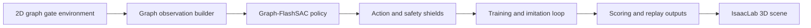

# AeroGate Graph



**Graph-based reinforcement learning for dense, dynamic drone gate traversal, single-agent and 8-drone formation.**

AeroGate Graph trains quadrotors to fly through dense, moving gate fields by encoding the layout as a graph. The stack covers a 2D graph environment, graph-structured policies, expert-guided imitation, curriculum training, multi-agent formation control and an IsaacLab bridge for 3D replay.

**Status.** `v0.1.0`. The 2D environment, graph policies, imitation pipeline, planner baselines and CPU test suite ship in this repository. IsaacLab 3D replay runs against a local Isaac Sim installation.

## Highlights

- **Graph state representation.** Gates become graph nodes with spatial and velocity features, and edges model feasible traversal order under motion.
- **Graph-FlashSAC.** A graph-structured soft actor-critic for single-agent flight through dense gates.
- **GraphMASAC.** 8-drone formation control with shared safety shielding.
- **Expert guidance.** A global route planner and an LLM-backed client inject waypoint and route hints during training.
- **DAgger-style imitation.** Expert rollouts bootstrap and regularize the policy before reinforcement fine-tuning.
- **Sim-to-real bridge.** 2D-trained policies replay and finetune inside IsaacLab 3D gate scenes.

## My Role

I authored this package end to end. The list below maps each workstream to the code that carries it.

- **Environment and task design.** `shared/core/` defines the shared 2D contract: circular gate-post collision, fixed-height dynamics, planar kinematics and the moving gate-density model. `tasks/single/env/` and `tasks/multi/env/` build the single-agent and 8-drone tasks on top of it with their own observation, reward and safety-shield settings, and `assets/gate_scene_layouts.py` plus `assets/gate_scene_builder.py` generate the gate courses used by the 3D scenes.
- **Graph reinforcement learning.** `tasks/single/graph_rl/graph_sac.py` and `graph_flashsac.py` implement the GraphSAC/Graph-FlashSAC agents; `tasks/multi/graph_rl/graph_flashsac.py`, `graph_masac.py` and `graph_policy.py` implement the shared graph encoder, the centralized critic and the GraphMASAC agent used by the 8-drone line. `tasks/multi/planners/`, `tasks/multi/guidance/` and `tasks/multi/formation/` add global route planning, asynchronous route guidance and formation slots.
- **Training and replay toolchain.** `tasks/multi/training/` and `tasks/single/training.py` run the training loop, checkpointing, evaluation metrics, early stopping, TensorBoard logging and live preview. `tasks/single/replay.py`, `tasks/multi/replay.py` and the IsaacLab replay and live-preview scripts replay trained policies in 2D and in the 3D scene through `shared/visualization/scene_isaaclab.py`, and every entry is exposed as a console script in `pyproject.toml`.
- **Experiments and reports.** `scripts/run_classic_planner_baselines.py`, `scripts/run_variable_team_size_eval.py` and `scripts/validate_paper_2d_curricula.py` run the planner baselines, variable-team evaluation and curriculum preflight; `tasks/density_single/` and `tasks/density_multi/` hold the gate-density curricula. The retained metrics live in `artifacts/evaluation/` and the write-ups in `docs/evaluation/`.

## Recorded Evidence

- The CPU test suite and the import smoke check run from a clean checkout, with commands in docs/evaluation/reproducibility.md.
- The recorded single-agent dynamic 42-gate baseline table puts the mainline method at success rate 1.0 and A* at 0.1 across 10 seeds.
- The recorded multi-agent static and dynamic demos hold 100.0 success rate and 0.0 collision rate at the 60 and 36 gate scenes, in `docs/evaluation/gate_graph_2d_evaluation_report.md`.

## Quick start

```bash
pip install -e ".[dev]"                                # CPU install covers tests and 2D rollouts
pytest
aerogate-train-multi --help                            # training entry point
aerogate-replay-multi                                  # 2D replay
aerogate-replay-multi-isaaclab                         # IsaacLab 3D replay
```

Large USD scenes live under `assets/five_in_drone/` and regenerate through the scene builders before 3D replay.

## Documentation

- `docs/evaluation/README.md` maps the scoring artifact set.
- `docs/evaluation/reproducibility.md` records versions, commands, seeds and expected outputs.
- `docs/evaluation/gate_graph_2d_evaluation_report.md` holds the compact scoring report.
- `artifacts/evaluation/results_manifest.json` lists machine-readable retained artifact metadata.
- `assets/five_in_drone/five_in_drone_spec_and_official_safety.md` documents the drone asset and the official safety distance basis.
- `CONTRIBUTING.md` records the development setup and change discipline.

## Design notes

- Training logic splits into focused submodules for the core loop, checkpointing, metrics, early stopping, logging and live preview.
- Action shielding keeps agents inside valid states during training and scoring.
- Seeds thread through the environment, policy, replay buffer and trainer for deterministic runs.
- A paper-scoring script validates 2D curricula and planner baselines before results are reported.

## Repository scope

Source, configs and tests ship in this repository. Trained checkpoints, run outputs and large USD scenes stay local and regenerate through the scripts above.

## License

Released under the terms in [LICENSE](LICENSE).

---

*Bohan Yu. Core implementation released with the associated paper.*
