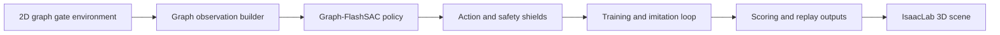

# AeroGate Graph



**Graph-based reinforcement learning for dense, dynamic drone gate traversal, single-agent and 8-drone formation.**

AeroGate Graph trains quadrotors to fly through dense, moving gate fields by encoding the layout as a graph. The stack covers a 2D graph environment, graph-structured policies, expert-guided imitation, curriculum training, multi-agent formation control and an IsaacLab bridge for 3D replay.

**Status.** `v0.1.0`. The 2D environment, graph policies, imitation pipeline, planner baselines and CPU test suite ship in this repository. IsaacLab 3D replay runs against a local Isaac Sim installation.

## Highlights

- **Graph state representation.** Gates become graph nodes with spatial and velocity features, and edges model feasible traversal order under motion.
- **Graph-FlashSAC.** A graph-structured soft actor-critic for single-agent flight through dense gates.
- **GraphMASAC.** 8-drone formation control with shared safety shielding.
- **Expert guidance.** A global route planner and an LLM-backed client inject waypoint and route hints during training.
- **DAgger-style imitation.** Expert rollouts bootstrap and regularize the policy before reinforcement fine-tuning.
- **Sim-to-real bridge.** 2D-trained policies replay and finetune inside IsaacLab 3D gate scenes.

## Recorded Evidence

- The CPU test suite passes at `8 passed`, and the import smoke check parses every Python file, both recorded in `evaluation_artifacts/reproducibility.md`.
- The recorded single-agent dynamic 42-gate baseline table puts the mainline method at success rate 1.0 and A* at 0.1 across 10 seeds.
- The recorded multi-agent static and dynamic demos hold 100.0 success rate and 0.0 collision rate at the 60 and 36 gate scenes, in `evaluation_artifacts/report/gate_graph_2d_evaluation_report.md`.

## Quick start

```bash
pip install -e ".[dev]"                                # CPU install covers tests and 2D rollouts
pytest
python multi_gate/scripts/train_multi.py --help        # training entry point
python multi_gate/scripts/replay_multi.py              # 2D replay
python multi_gate/scripts/replay_multi_isaaclab.py     # IsaacLab 3D replay
```

Large USD scenes live under `assets/5_in_drone/` and regenerate through the scene builders before 3D replay.

## Documentation

- `evaluation_artifacts/README.md` maps the scoring artifact set.
- `evaluation_artifacts/reproducibility.md` records versions, commands, seeds and expected outputs.
- `evaluation_artifacts/report/gate_graph_2d_evaluation_report.md` holds the compact scoring report.
- `assets/5_in_drone/5_in_drone_spec_and_official_safety.md` documents the drone asset and the official safety distance basis.
- `CONTRIBUTING.md` records the development setup and change discipline.

## Design notes

- Training logic splits into focused submodules for the core loop, checkpointing, metrics, early stopping, logging and live preview.
- Action shielding keeps agents inside valid states during training and scoring.
- Seeds thread through the environment, policy, replay buffer and trainer for deterministic runs.
- A paper-scoring script validates 2D curricula and planner baselines before results are reported.

## Repository scope

Source, configs and tests ship in this repository. Trained checkpoints, run outputs and large USD scenes stay local and regenerate through the scripts above.

## License

Released under the terms in [LICENSE](LICENSE).

---

*Bohan Yu. Core implementation released with the associated paper.*
