# AeroGate Graph

<p align="center">
  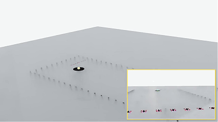
  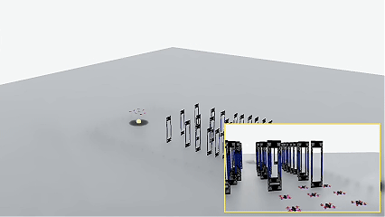
</p>

<p align="center"><em>图结构多无人机编队控制、路线规划与动态闸门导航。</em></p>

[English](README.md) | [简体中文](README.zh-CN.md)

**AeroGate Graph 是一个用于研究密集动态闸门场中多无人机编队控制的可复现研究环境。** 项目将确定性的固定高度二维核心，与可选的 PyTorch 训练和 Isaac Lab 回放分开，使路线进度、编队误差、间距安全和策略行为可以分别检查。

## 研究问题

核心问题是：可变规模的无人机团队如何沿全局路线前进，同时保持可变形编队，并满足碰撞与闸门通道约束。实现包含：

- 面向闸门、路线、无人机、障碍物和有效智能体掩码的图观测；
- 将队伍中心和航向映射为逐机目标的虚拟结构编队槽位；
- A* 全局路线规划、局部运动学检查和动作级安全屏蔽；
- 单机 Graph-SAC，以及集中式评论家 Graph-MASAC/Graph-FlashSAC 路径；
- 专家预训练、DAgger 式模仿、课程训练和可选 Isaac Lab 三维回放。

## 图像证据导览

下面的图片对应具体的建模、训练和评测内容，不是装饰性截图。

### 编队转场误差

四张误差曲线分别展示直线到三角形、三角形到矩形、矩形到菱形以及菱形到圆形的八机编队转场，同时保留逐机误差和团队均值。

<p align="center">
  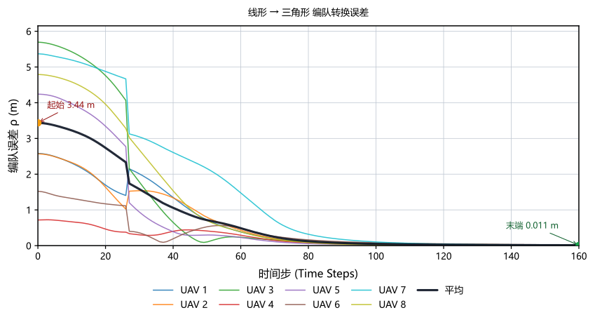
  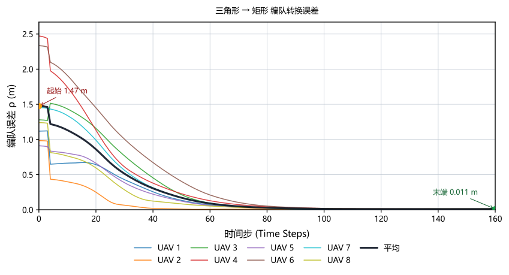
  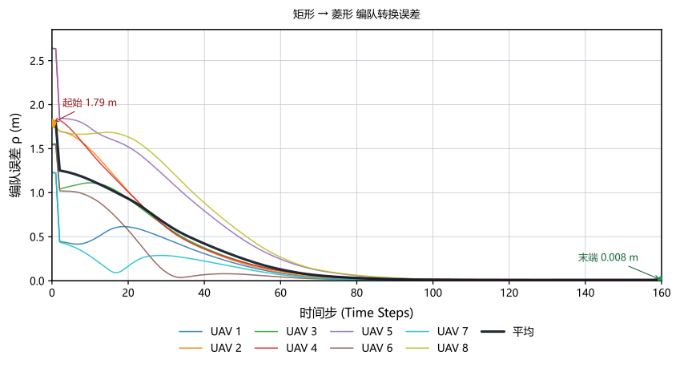
  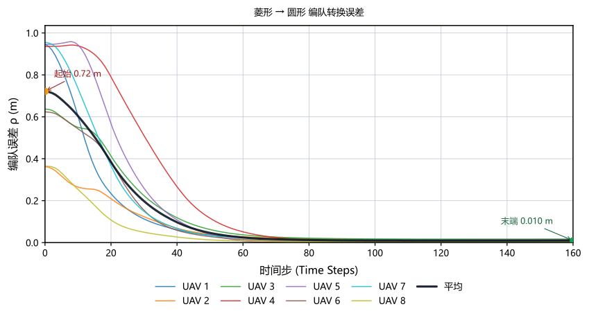
</p>

### 路线与仿真回放

这些图把二维任务与 Isaac Lab 接口连接起来，展示逐机路线、四阶段编队转场、固定高度三维场景以及跟随视角回放。

<p align="center">
  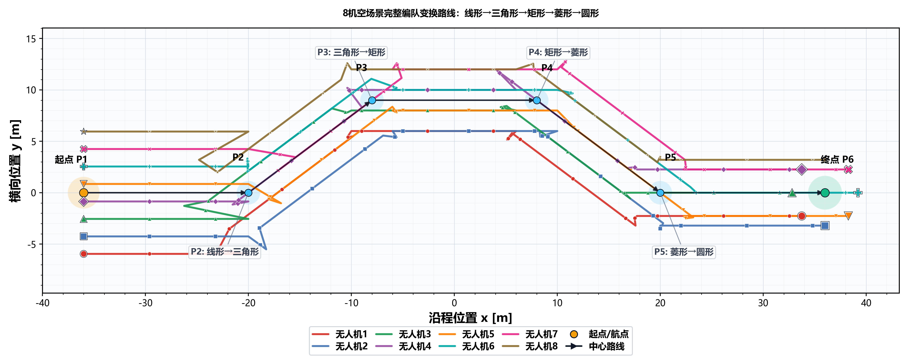
  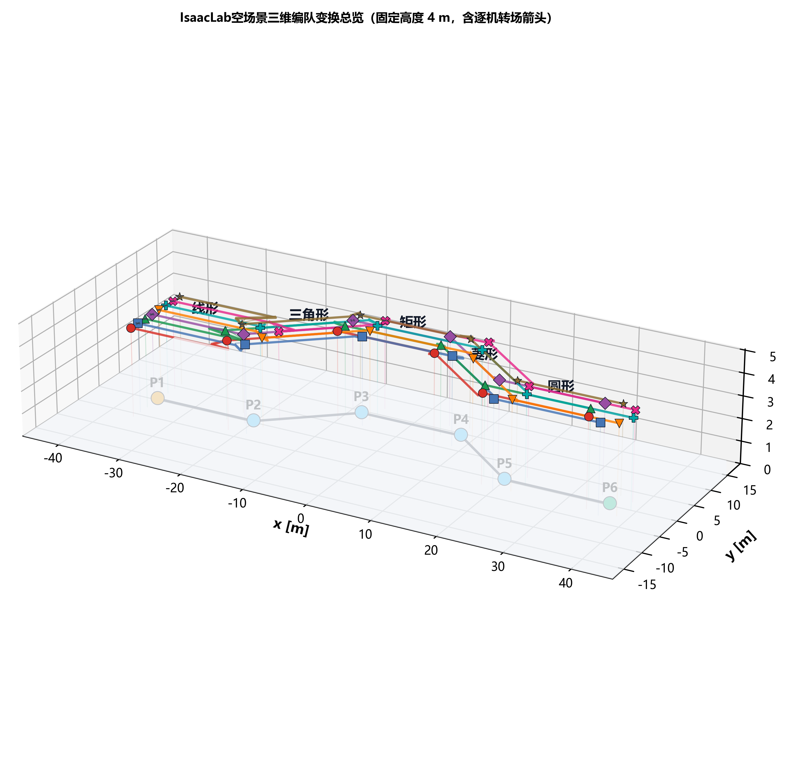
  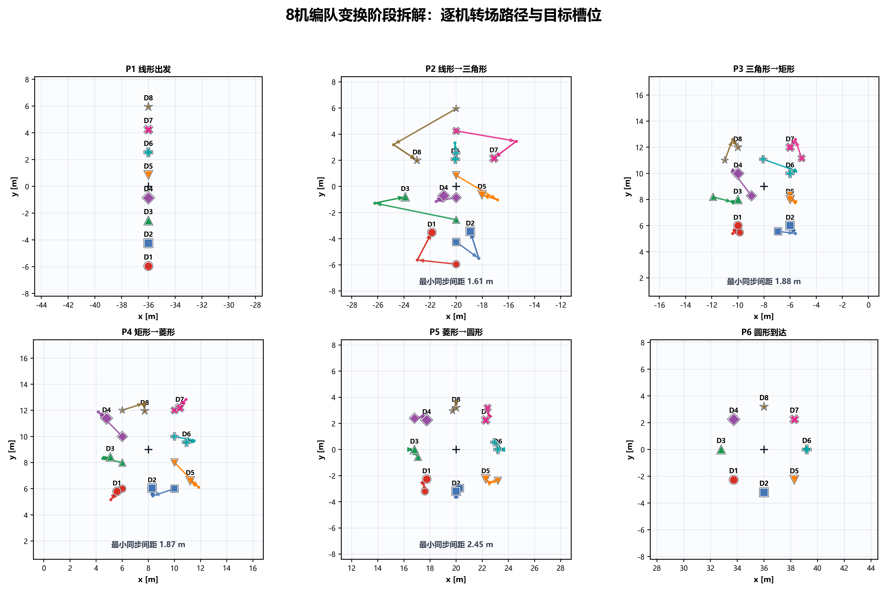
  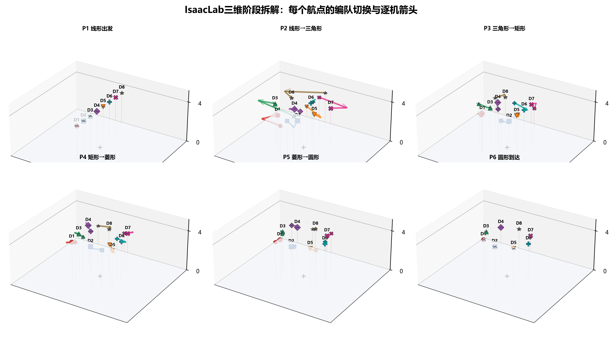
  
  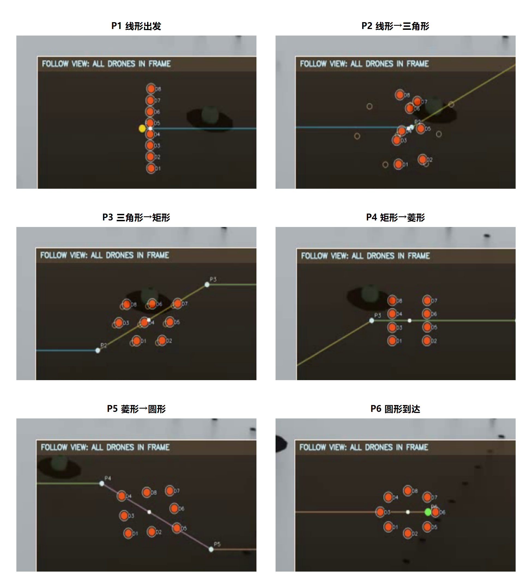
</p>

### 控制与学习设计

这些图明确展示控制闭环：虚拟结构将团队状态转换为槽位目标；图编码器聚合节点和边信息；集中式评论家评估联合动作；奖励反馈与课程阶段驱动策略更新。

<p align="center">
  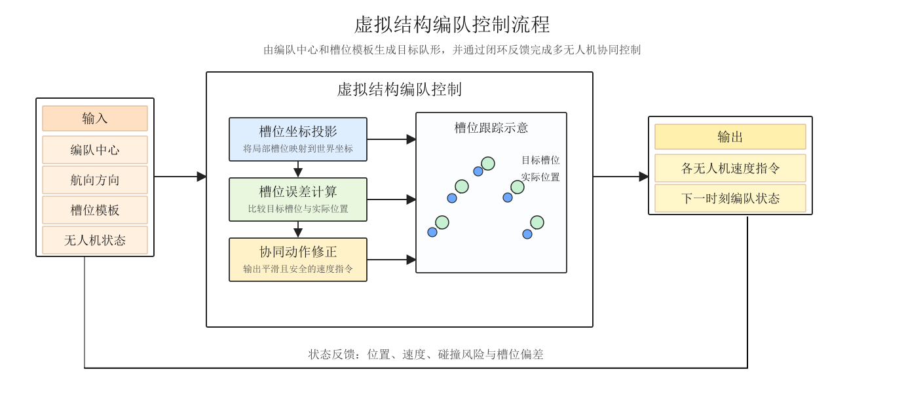
  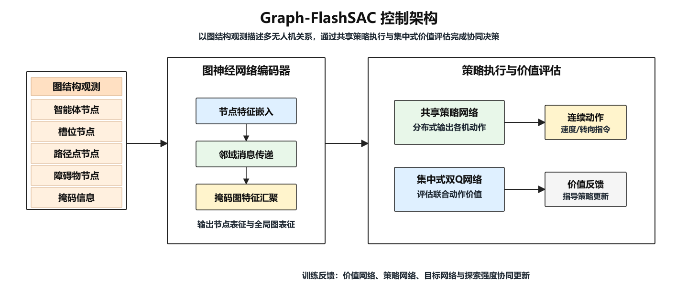
  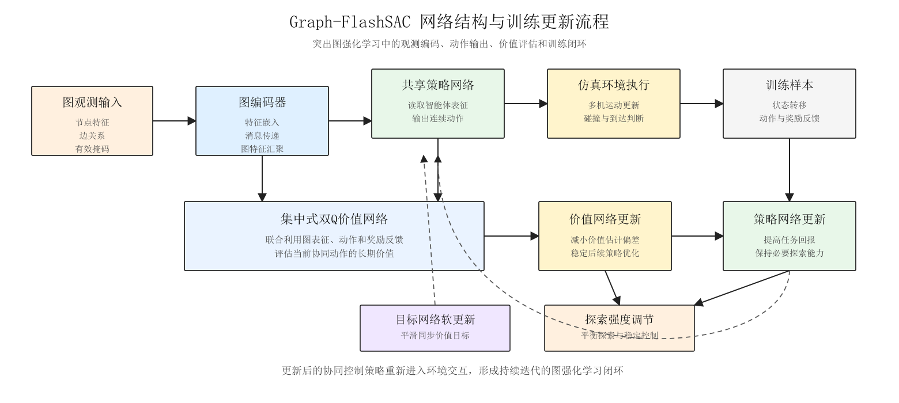
  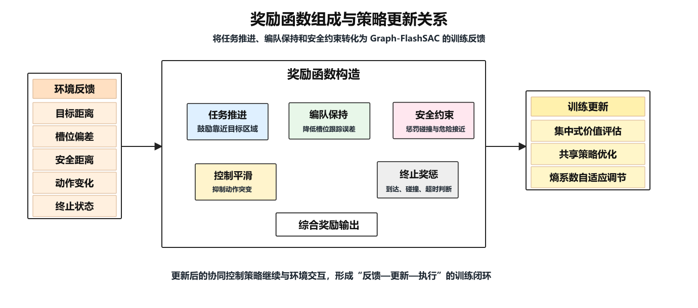
  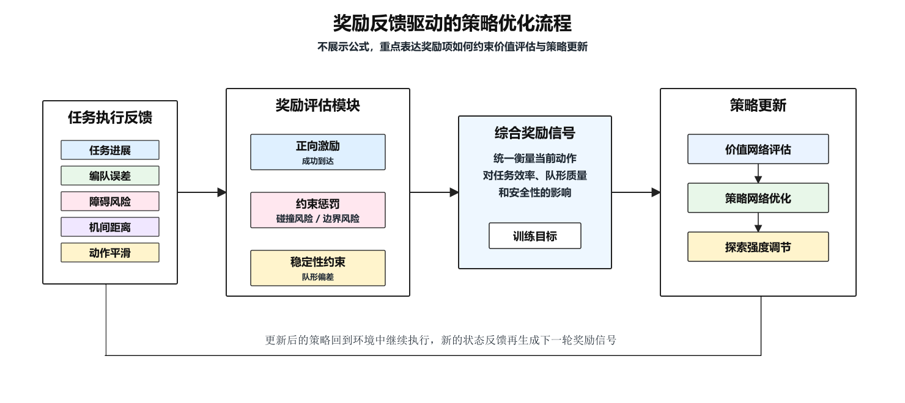
  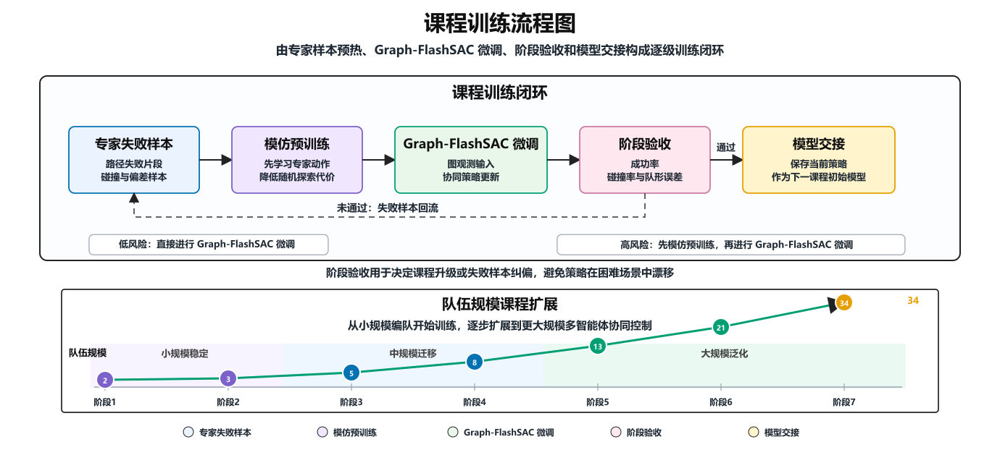
</p>

### 多指标评测

多指标压力热力图用于观察不同阶段的编队质量、安全性和任务压力变化，应与原始回放和带种子报告一起解读，不能单独作为性能结论。

<p align="center">
  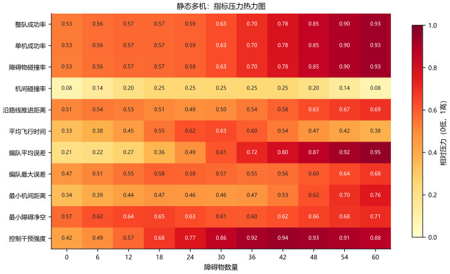
</p>

## 实现索引

| 内容 | 代码路径 |
| --- | --- |
| 固定高度运动学、闸门与碰撞几何 | `shared/core/` |
| 可变规模多机环境、观测、奖励与安全屏蔽 | `multi_gate/env/` |
| 虚拟结构编队槽位 | `multi_gate/formation/` |
| 全局路线规划 | `multi_gate/planners/` |
| Graph-SAC 与 Graph-MASAC/FlashSAC | `single_gate/graph_rl/`、`multi_gate/graph_rl/` |
| 课程与密度评测 | `gate_density_single/`、`gate_density_multi_8/` |
| Isaac Lab 场景和回放适配器 | `shared/visualization/`、`multi_gate/scripts/` |
| 公共 CLI 与确定性报告 | `aerogate/` |

英文研究边界见 [Research Overview](docs/RESEARCH_OVERVIEW.md)、[Architecture](docs/ARCHITECTURE.md) 和 [Reproducibility](docs/REPRODUCIBILITY.md)。

## 快速开始

```powershell
uv sync --extra dev
uv run python -m aerogate info
uv run python -m aerogate smoke --scenario multi-static --agents 4 --steps 8
uv run python -m pytest
```

项目核心环境是固定高度二维研究抽象；测试通过不等于真实飞行安全、感知性能、飞行动力学或 sim-to-real 有效性。

## 许可证

见 [LICENSE](LICENSE) 和 [THIRD_PARTY_NOTICES.md](THIRD_PARTY_NOTICES.md)。
