# KernelVision 内核视觉实验集

[English](README.md) | [简体中文](README.zh-CN.md)

<p align="center">
  <a href="figures/exp1_filtering.gif">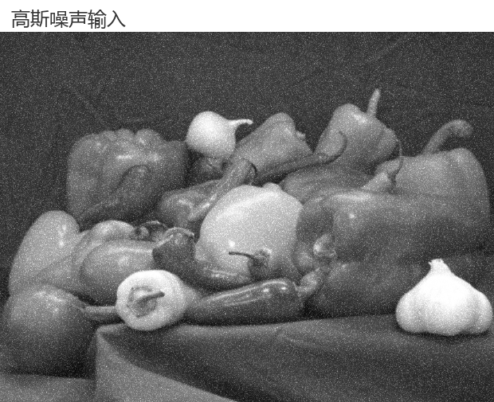</a>
  <a href="figures/exp2_edges.gif"></a>
</p>
<p align="center">
  <a href="figures/exp2_harris.gif">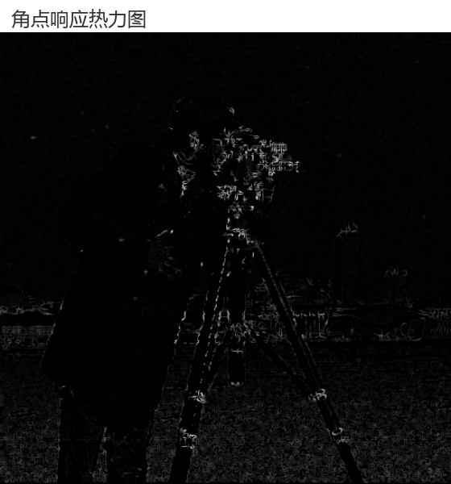</a>
  <a href="figures/exp3_detection.gif">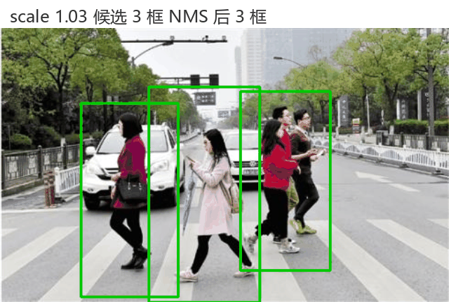</a>
</p>
<p align="center">
  <a href="figures/exp4_training.gif">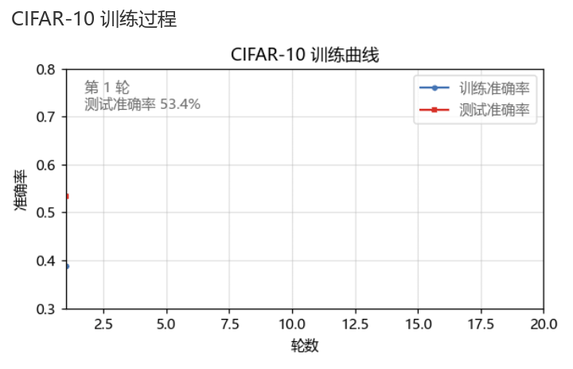</a>
</p>
<p align="center"><b>五段动图演示：空域滤波 · 边缘检测 · 角点检测 · 行人检测 · 网络训练</b></p>

**四个循序渐进的计算机视觉实验，贯穿一条主线——卷积核：从经典空域滤波走向学习到的特征表示。依次完成图像空域滤波、图像特征检测、HOG 行人检测与卷积神经网络实践。**

滤波实验采用两层评价方案：真实含噪图使用平坦区域噪声标准差、残余脉冲率与边缘梯度斜率做无参考比较；受控实验在干净参考图上合成已知强度噪声，报告 PSNR、SSIM 与边缘保持指数，并完成核尺寸与标准差参数的完整扫描。特征实验实现 Canny 边缘检测与 Harris 角点检测流水线，量化 Sobel 孔径带来的梯度幅值尺度变化，并证明角点集中在边缘结构上。行人检测实验加载 OpenCV 预训练的 HOG 加线性 SVM 检测器，实现 Malisiewicz 非极大值抑制，围绕 5 名人工标注行人绘制 scale、winStride、padding 与重叠阈值的召回率、精确率与耗时地图。网络实验在 CIFAR-10 上训练两段式卷积网络，对比五组参数配置。

**进度。** 课程实验全部完成，代码、完整图表、指标数据与训练好的基线模型都在本仓库中。

## 我的工作

余博涵独立完成了四个实验的全流程：滤波实验的两层评价方案，包括受控合成噪声研究与核尺寸与标准差参数扫描；Canny 与 Harris 流水线，包括阈值扫描、梯度幅值尺度补偿与边缘角点联合分析；手写非极大值抑制的 HOG 滑窗检测器与基于标注框的参数分析；以及 CIFAR-10 上带五组消融对比的 PyTorch 卷积网络。图表、动图与文档均出自同一项工作。

## 实验一览

| 序号 | 实验 | 方法 | 关键结果 |
|---|---|---|---|
| 1 | 图像空域滤波 | 均值、高斯、中值与双边滤波，受控实验与无参考评价 | 椒盐噪声下 3×3 中值滤波 PSNR 39.54 dB、SSIM 0.986；高斯噪声下高斯滤波 PSNR 31.48 dB，σX 扫描峰值 31.41 dB 位于 1.0 |
| 2 | 图像特征检测 | Canny 边缘检测、Harris 角点检测、参数扫描 | 阈值 100/200 取得 150 个连通边缘；非极大值抑制后 468 个角点，100% 位于边缘邻域内 |
| 3 | HOG 行人检测 | OpenCV HOG 加线性 SVM、图像金字塔滑窗、Malisiewicz 非极大值抑制 | 最佳配置召回率 0.6、精确率 1.0；CPU 单帧耗时约 7 毫秒到 35 毫秒 |
| 4 | 卷积神经网络 | CIFAR-10 两段式卷积网络、数据增强、五组消融对比 | 测试准确率 76.9%；学习率稳定区间 0.0001 到 0.001；混淆集中在猫狗与汽车卡车类别对 |

## 结果预览

### 1 图像空域滤波

<p align="center">
  <a href="figures/exp1_noise_analysis.png">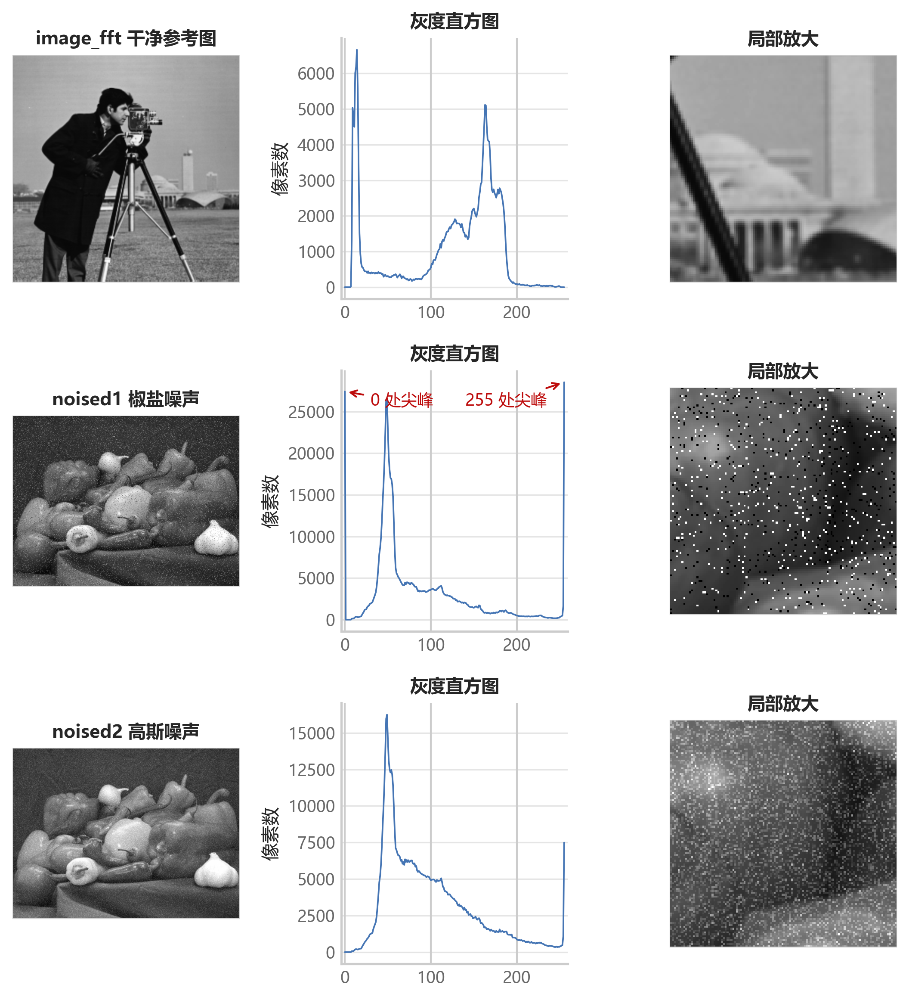</a>
  <a href="figures/exp1_comparison_salt_pepper.png">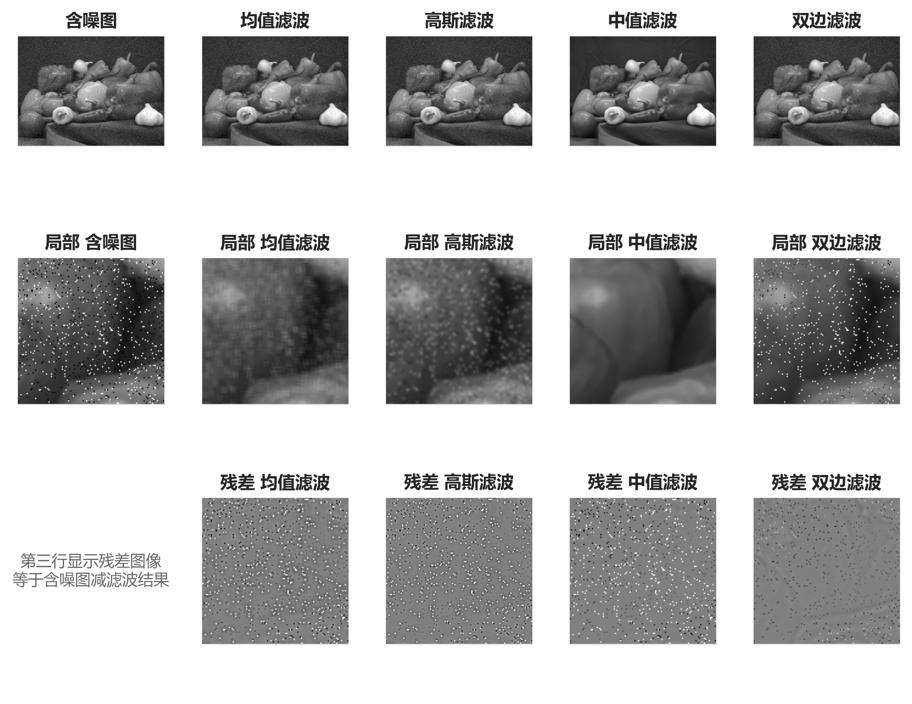</a>
</p>

椒盐噪声图的极端像素占比为 7.1%，脉冲密度估计 4.2%；高斯噪声图的噪声标准差估计为 20.0。三类线性与排序滤波器都能清除脉冲，残差图清晰拉开差距：均值与高斯滤波把脉冲能量摊进邻域，中值滤波用局部中位数直接替换脉冲像素。

<p align="center">
  <a href="figures/exp1_parameter_sweep.png">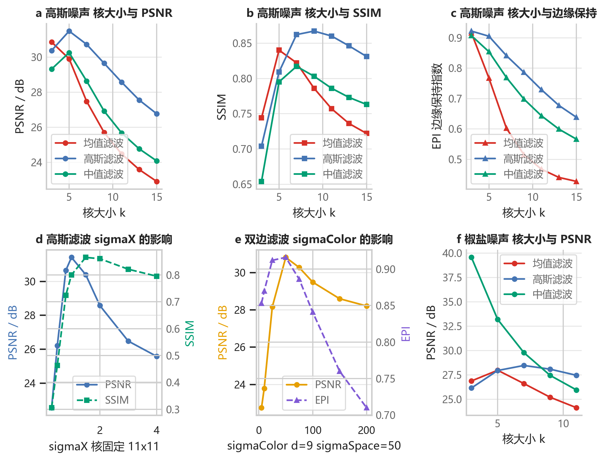</a>
</p>

受控实验中，中值滤波在椒盐噪声下排名第一（5×5 核 33.17 dB），高斯滤波在高斯噪声下排名第一，双边滤波以 0.916 的边缘保持指数取得四类最高。

### 2 图像特征检测

<p align="center">
  <a href="figures/exp2_canny_thresholds.png">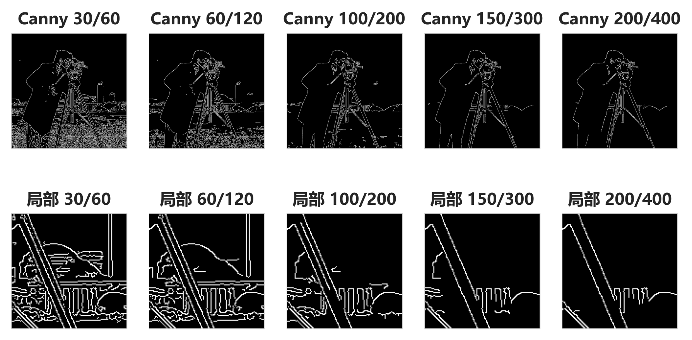</a>
  <a href="figures/exp2_canny_variants.png">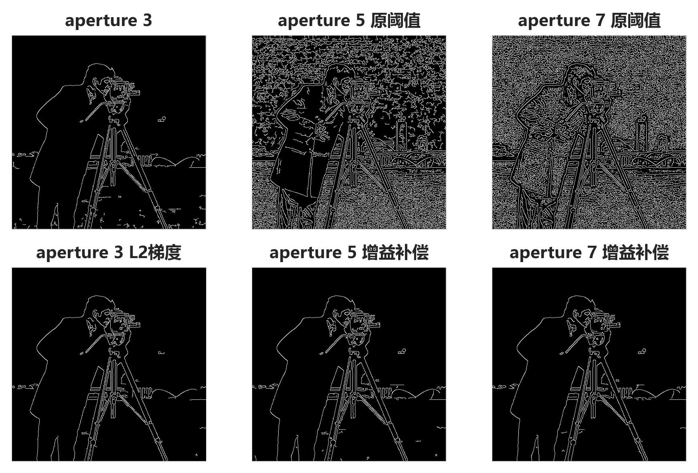</a>
</p>

阈值对从 30/60 升高到 200/400，边缘像素占比从 10.2% 降到 2.2%，边缘处平均梯度从 136 升到 336。Sobel 孔径增大使梯度幅值尺度扩大 14 倍与 203 倍；按实测增益同步补偿阈值后，边缘恢复干净。

<p align="center">
  <a href="figures/exp2_harris_corners.png">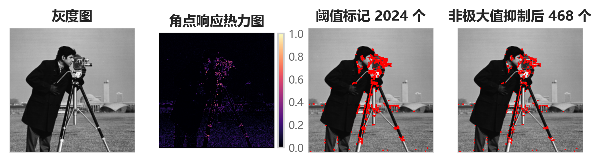</a>
  <a href="figures/exp2_edge_corner_relation.png">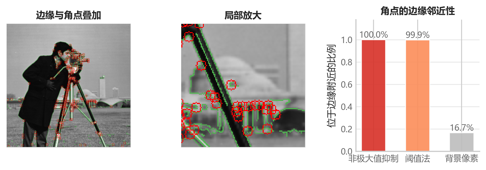</a>
</p>

非极大值抑制把 2024 个原始响应像素收敛为 468 个稳定角点，全部落在 Canny 边缘邻域内。

### 3 HOG 行人检测

<p align="center">
  <a href="figures/exp3_hog_features.png">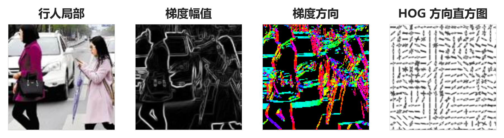</a>
  <a href="figures/exp3_detection_nms.png">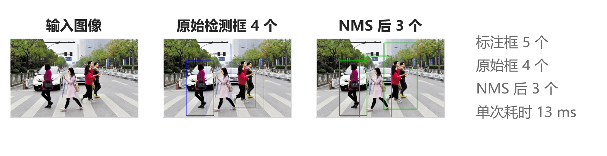</a>
</p>

64×128 检测窗口由 8×8 细胞单元与 16×16 块构成 3780 维特征向量。非极大值抑制把原始候选框合并为一目标一框。

<p align="center">
  <a href="figures/exp3_scale_sweep.png">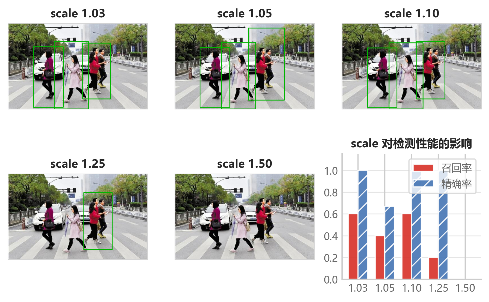</a>
  <a href="figures/exp3_stride_padding.png">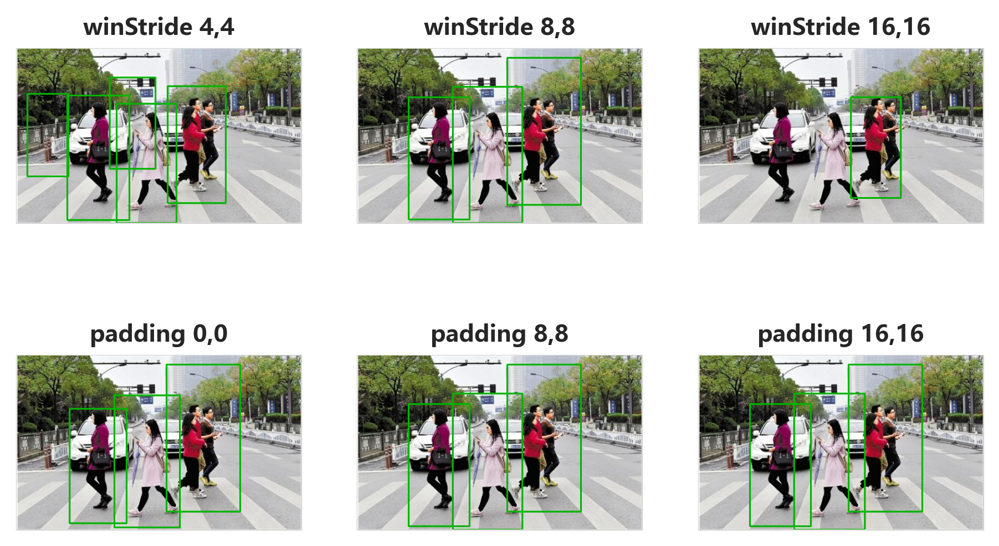</a>
</p>

scale 取 1.03 与 1.10 时召回率 0.6、精确率 1.0；scale 取 1.50 时金字塔步长超过目标尺寸范围，全部漏检。步长越细，召回率与耗时同步上升，精度与速度的取舍一目了然。

### 4 卷积神经网络

<p align="center">
  <a href="figures/exp4_network_architecture.png">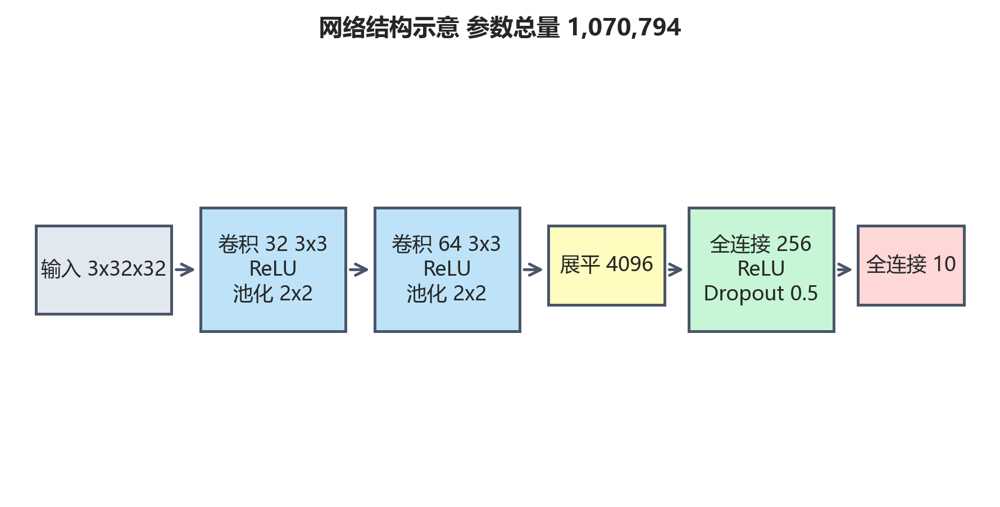</a>
  <a href="figures/exp4_training_curves.png">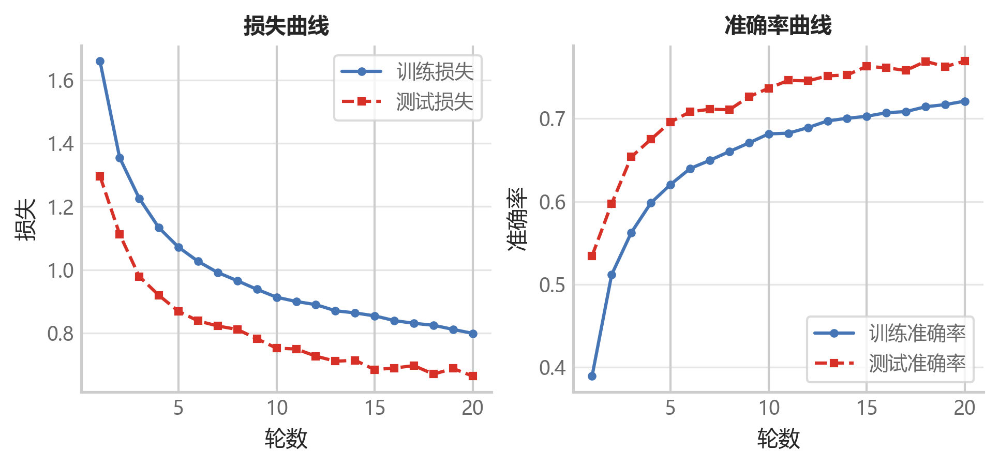</a>
</p>

网络参数总量 1,070,794，其中 98% 位于全连接层。基线训练 20 轮，测试准确率 76.9%。

<p align="center">
  <a href="figures/exp4_confusion_accuracy.png">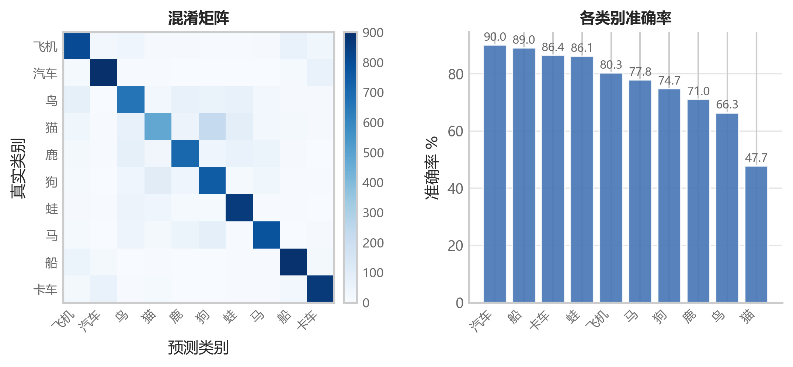</a>
  <a href="figures/exp4_predictions.png">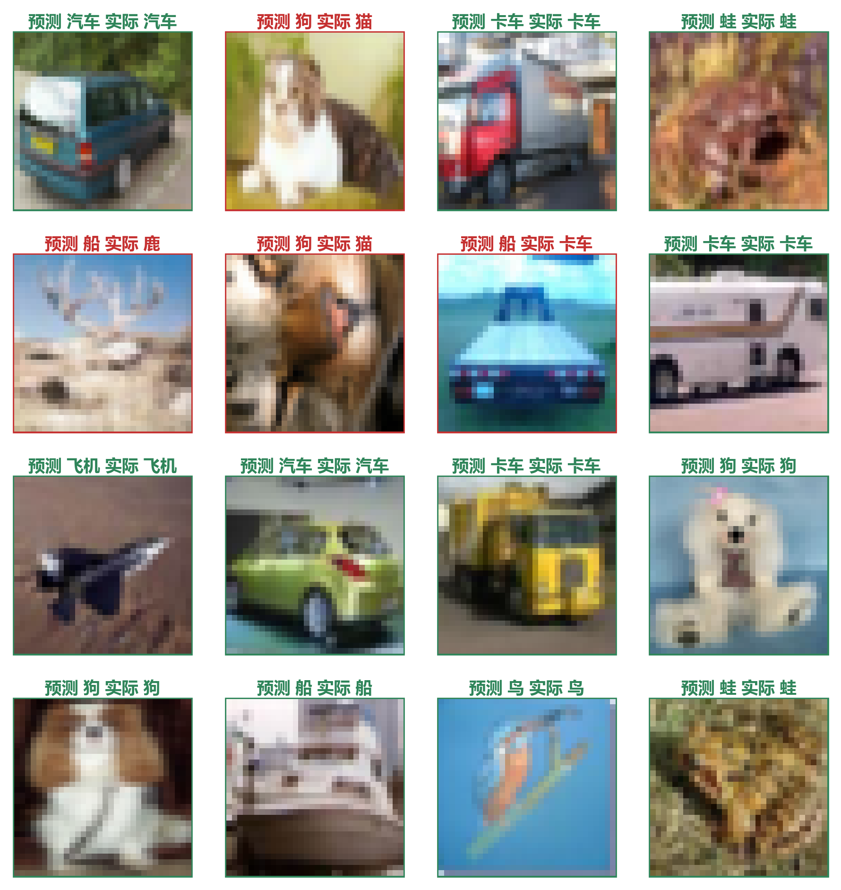</a>
</p>

各类别准确率从 47.7%（猫）到 90.0%（汽车）。错误集中在猫狗对（双向混淆 228 与 99）、汽车卡车对（61 与 62）与鸟飞机对（75 与 42）之间。

## 仓库结构

```
KernelVision/
├── run_all.py                  一键运行四个实验
├── requirements.txt            固定版本依赖
├── figures/                    README 素材：动图与预览图
├── exp1_filtering/             实验一 图像空域滤波
├── exp2_features/              实验二 图像特征检测
├── exp3_hog/                   实验三 HOG 行人检测
└── exp4_cnn/                   实验四 卷积神经网络
```

每个实验目录包含 `code/` 源码、`images/` 输入数据、`figures/` 报告插图、`results/` 指标 CSV 与 `output/` 过程图。训练好的基线模型位于 `exp4_cnn/output/model_baseline.pt`。

## 运行方式

Python 3.11 与固定版本依赖：

```bash
pip install -r requirements.txt
python run_all.py
```

每个实验均可独立运行，例如：

```bash
python exp2_features/code/experiment2_features.py
```

网络实验支持免训练重绘插图（读取已保存的模型与指标表）：

```bash
python exp4_cnn/code/experiment4_cnn.py figures
```

完整运行的耗时约四十分钟，主要花在实验四的十三次训练上。

## 数据说明

| 实验 | 数据 | 来源 |
|---|---|---|
| 一 | image_fft.png、noised1.png、noised2.png | 课程实验数据集 |
| 二 | test.png | 课程实验数据集 |
| 三 | people.jpg | 课程实验数据集 |
| 四 | CIFAR-10 | torchvision 自动下载 |

## 引用

- Dalal N, Triggs B. Histograms of Oriented Gradients for Human Detection. CVPR, 2005.
- Tomasi C, Manduchi R. Bilateral Filtering for Gray and Color Images. ICCV, 1998.
- Canny J. A Computational Approach to Edge Detection. IEEE TPAMI, 1986.

以 Unlicense 释入公有领域，见 [LICENSE](LICENSE)。
