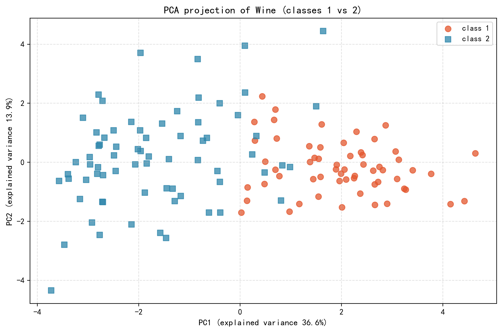
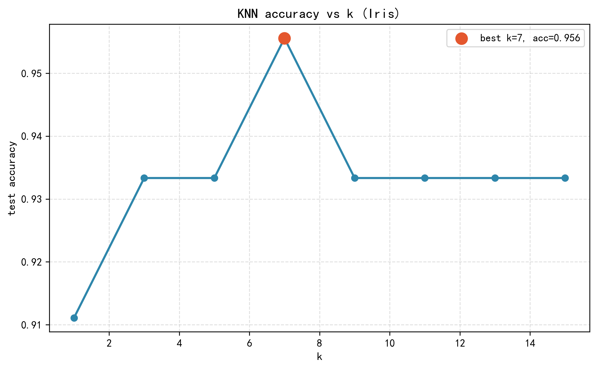

# Machine Learning Coursework

[English](README.md) | [简体中文](README.zh-CN.md)

This directory consolidates two self-contained machine-learning coursework projects. The original project folders, source code, datasets, reports, generated figures, and result tables are retained under one stable portfolio path.

## Projects

| Project | Scope | Stack |
|---|---|---|
| [Classic ML Algorithms](classic-ml-algorithms/) | Ten from-scratch implementations spanning ensembles, trees, clustering, association rules, and PageRank | Python, NumPy, public datasets |
| [ML Assignment 3](ml-assignment-3/) | PCA/LDA, an Iris kNN sweep, and a Wine kNN-versus-ID3 comparison | Python, NumPy, pandas, scikit-learn, matplotlib |

## Assignment 3 Preview

<p align="center">
  <a href="ml-assignment-3/results/pca_visualization.png"></a>
  <a href="ml-assignment-3/results/knn_accuracy_vs_k.png"></a>
</p>

The figures remain in `ml-assignment-3/results/` and are linked from the assignment README. They were moved with the project; they were not removed.

## Layout

```text
machine-learning/
  README.md
  README.zh-CN.md
  classic-ml-algorithms/
  ml-assignment-3/
```

Use each child README for setup, run commands, generated artifacts, and scope limits.
