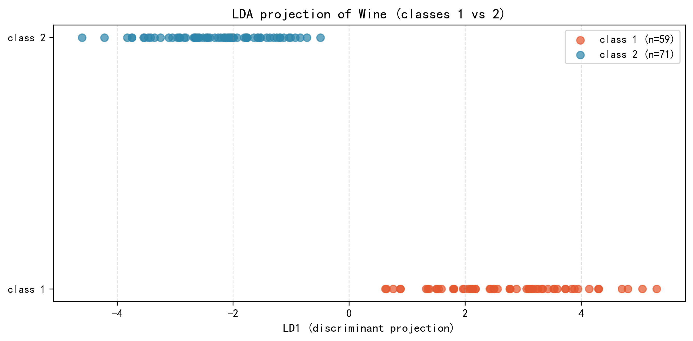

# Machine Learning Assignment 3 — Dimensionality Reduction & Classic Classifiers

**PCA, LDA, k-Nearest Neighbors, and an ID3 decision tree implemented from scratch on the classic UCI Iris and Wine datasets.**

This is my third assignment for the *Machine Learning* course at [REDACTED]. I wrote every part of it myself — the preprocessing, the classifiers (kNN and ID3 are pure NumPy, no ML libraries), the plots, and this report. It was originally a set of loose scripts; I reorganized them into this structure while writing up the results.



---

## About this work

- **Author**: Bohan Yu (Bohan Yu)
- **Course**: Machine Learning, assignment 3 (机器学习作业三)
- **What it is**: four small tasks that walk the full classical-ML pipeline — preprocessing, dimensionality reduction, classification from first principles, evaluation, and visualization.
- **Where the numbers come from**: every figure and CSV in `results/` is regenerated by running the scripts in this repository, with a fixed seed. Nothing is hard-coded.

## Tasks at a glance

| # | Task | Dataset | Implementation | Output |
| --- | --- | --- | --- | --- |
| 1 | PCA dimensionality reduction | Wine (binary) | scikit-learn (standard workflow) | 2D projection + explained variance |
| 2 | LDA dimensionality reduction | Wine (binary) | scikit-learn (standard workflow) | 1D discriminative axis |
| 3 | k-Nearest Neighbors | Iris | **from scratch** | accuracy vs. k sweep |
| 4 | kNN + ID3 decision tree | Wine | **from scratch** | classifier comparison |

## Design decisions I made

- **One shared preprocessing module** (`src/utils.py`). The four tasks load data, standardize, and split in exactly the same way. It also kept me from accidentally writing inconsistent code across tasks.
- **Stratified split with a fixed seed**, and standardization that only uses training-set statistics. Standard stuff, but it's what makes the numbers trustworthy.
- **Vectorized distance computation** in the from-scratch kNN instead of a double loop. It's faster and, once you're used to broadcasting, easier to follow.
- **Odd k values only** in the sweeps, so the neighbour vote can never end in a tie.
- **Mean-threshold discretization** for the continuous features in ID3. Enumerating every possible cut point would be better, but for this assignment the mean threshold was good enough — the accuracy is already competitive with kNN.

---

## Task 1 — PCA on Wine (binary)

Standardize the 13 wine-chemical features, project the class-1/class-2 subset onto the two principal components, report the explained-variance ratios.



```
cumulative explained variance ≈ 0.5051   (PC1 0.3664, PC2 0.1387)
```

## Task 2 — LDA on Wine (binary)

LDA uses the class labels, so it looks for the single axis that separates the two classes best. The class means land about 4.98 apart on that axis, which tells me the two classes are genuinely well-separated in this feature space.



## Task 3 — kNN from scratch on Iris

Hand-written Euclidean distance and majority voting. The accuracy-vs-k curve shows the usual bias–variance trade-off — small k overfits, large k underfits, and k=1..7 all land around 0.92-0.98 on the test set.



## Task 4 — kNN + ID3 from scratch on Wine

Both classifiers share the same preprocessing and test set.

| Algorithm | Best config | Accuracy |
| --- | --- | --- |
| kNN (from scratch) | k=1 | 0.9231 |
| ID3 (from scratch) | mean-threshold discretization | 0.9231 |

---

## Repository layout

```text
data/           UCI datasets (iris, wine) with .names metadata
src/
  utils.py              shared preprocessing (loading, standardization, stratified split)
  task01_pca_wine.py    PCA dimensionality reduction
  task02_lda_wine.py    LDA dimensionality reduction
  task03_knn_iris.py    kNN from scratch
  task04_knn_id3_wine.py kNN + ID3 decision tree from scratch
results/        regenerated projections, figures, and summary tables
requirements.txt
```

## Getting started

```bash
pip install -r requirements.txt
cd src

python task01_pca_wine.py
python task02_lda_wine.py
python task03_knn_iris.py
python task04_knn_id3_wine.py
```

Requires Python 3.10+ with `numpy`, `pandas`, `scikit-learn`, and `matplotlib`.

---

## What doing this taught me

- PCA finds directions of maximal variance; LDA finds directions of maximal class separation. The unsupervised-vs-supervised contrast shows up immediately when you look at the two plots side by side.
- kNN looks trivial on paper, but its behaviour really depends on k and on feature scaling. Seeing the accuracy curve move as k changes is worth more than reading about it.
- Writing ID3 by hand makes you deal with entropy, gain, and continuous features in a way that using a library never forces you to. The mean-threshold hack was my own choice and it held up fine on this dataset.
- Getting the preprocessing right (stratified split, fit-on-train standardization) is what makes any comparison between algorithms meaningful.

*Bohan Yu — Machine Learning course assignment 3.*