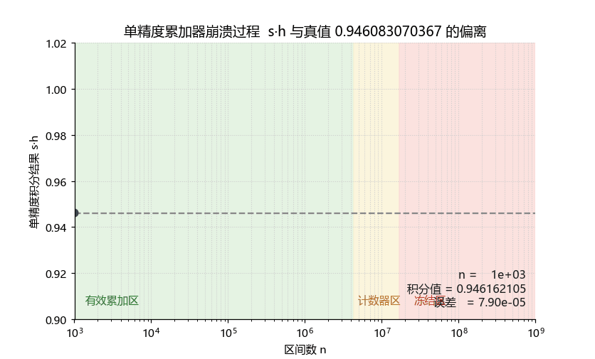
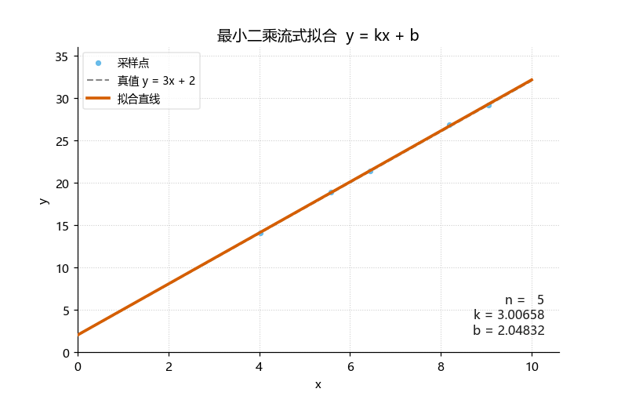
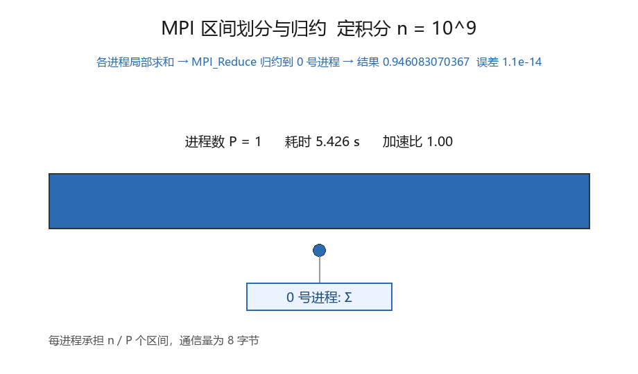
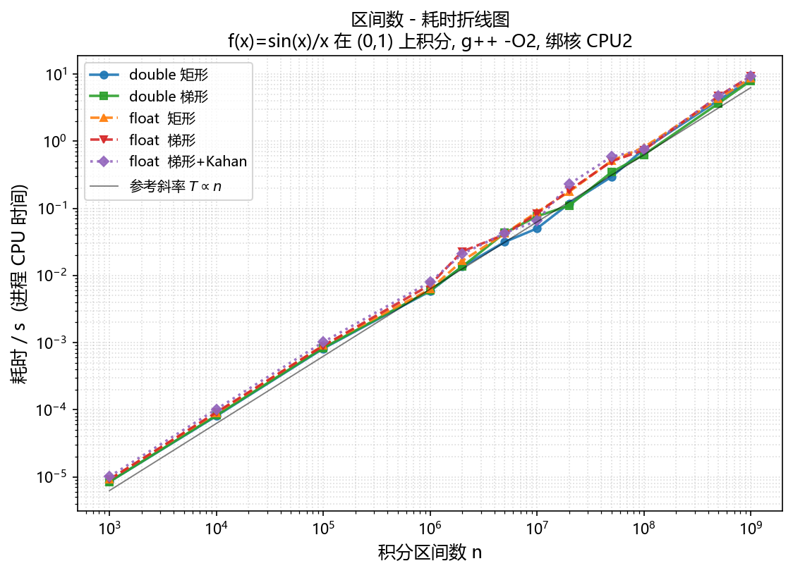
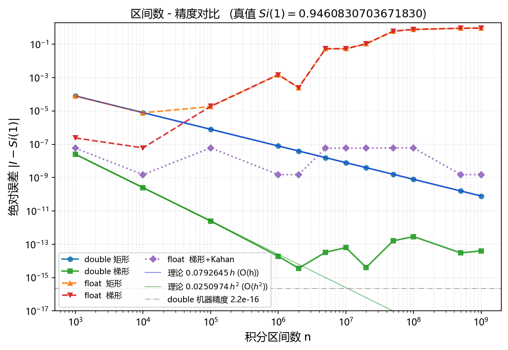
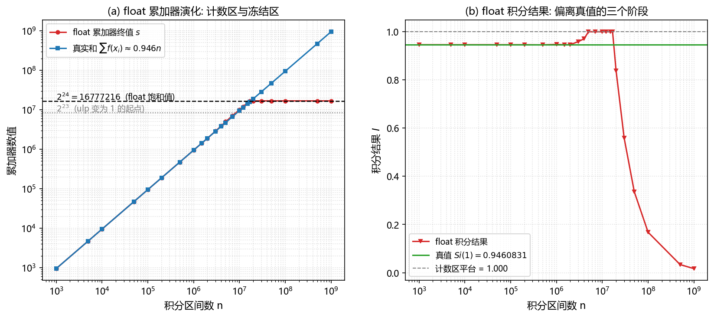
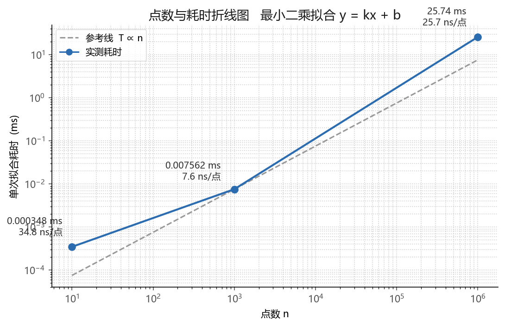
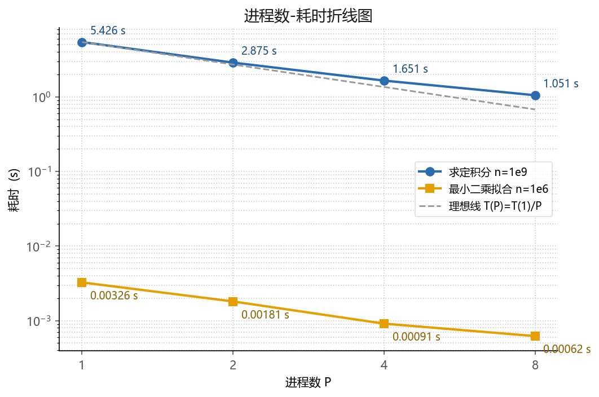
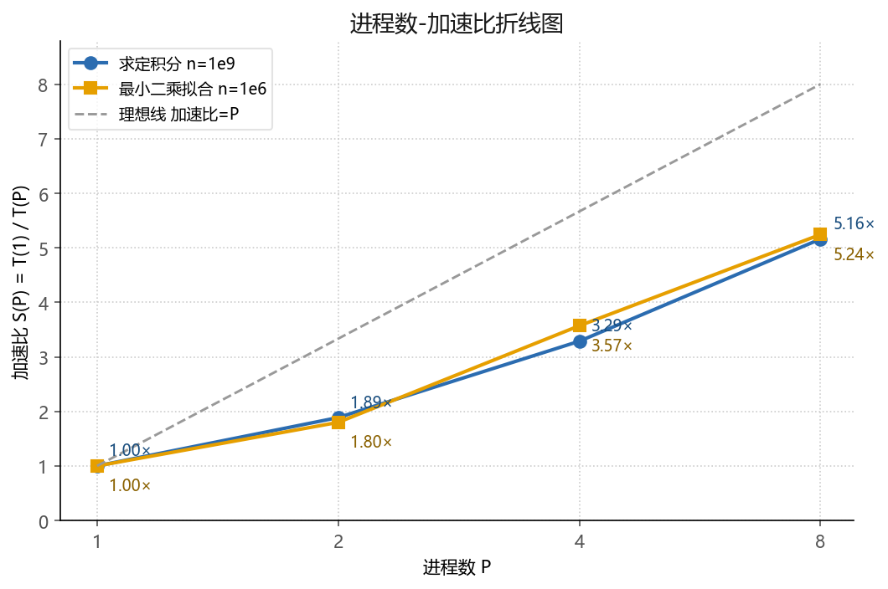

# 时空大数据高性能处理实验

[English](README.md) | [中文](README.zh-CN.md)

<p align="center">
  <a href="figures/lab1_float_crash.gif"></a>
  <a href="figures/lab4_warp_morph.gif"></a>
</p>
<p align="center">
  <a href="figures/lab2_fit_stream.gif"></a>
  <a href="figures/lab3_mpi_partition.gif"></a>
</p>
<p align="center"><b>四段动画演示：单精度崩溃 → 流式拟合 → MPI 划分归约 → 仿射形变</b></p>

**四次上机实验的完整实现：定积分计算与单精度累加崩溃研究，从零实现的矩阵基本运算与最小二乘拟合，MPI 分布式内存版本，以及 OpenMP 共享内存的图像仿射重采样。全部程序为 C++17，用 g++ 与 OpenMPI 编译，测量在同一台机器上完成。**

四个实验层层递进：定积分实验测量 10³ 到 10⁹ 区间数的矩形法与梯形法，定位单精度累加器的崩溃机制；矩阵实验从零实现四个基本运算并驱动最小二乘拟合；MPI 实验把定积分与拟合改造成多进程版本并给出进程扩展表；OpenMP 实验从四角点拟合 8 方程 6 参数的仿射模型，用间接法加双线性插值完成 12001 × 11001 图像的重采样。

**状态。** 课程已完成，报告与答辩材料在课程工作区，本仓库保留核心源码、全部图表与动画演示。

## 个人工作

余博涵独立完成四次实验的全部环节：从零实现四个矩阵运算、高斯约当求逆与 Kahan 补偿求和；编写诊断程序定位单精度累加崩溃的完整机制；实现定积分与最小二乘的 MPI 分块归约版本；实现基于最小二乘仿射拟合的 OpenMP 图像重采样。测量数据、图表、动画与文档同属这一工作。

## 实验一览

| # | 实验 | 方法 | 关键结果 |
|---|---|---|---|
| 1 | 编程求定积分 | 矩形法与梯形法，10³ 至 10⁹ 共 12 档，单双精度对照，Kahan 补偿 | T(n) ∝ n，8.5 微秒增至 7.92 秒；梯形法误差 4.03e-14；单精度累加器钉在 1.0 后冻结，误差 5.4e-2；Kahan 把单精度误差压回 1.5e-9 |
| 2 | 矩阵运算与最小二乘 | 从零实现四个矩阵运算，高斯约当求逆，正则方程求解 | k = 2.9997402，b = 1.9997501；10 点耗时 0.35 微秒，10³ 点单点 7.6 ns，10⁶ 点耗时 25.7 毫秒 |
| 3 | MPI 分布式内存编程 | 块划分加 MPI_Reduce 归约，1 2 4 8 进程 | 积分 5.43 秒降至 1.05 秒，加速比 5.16；拟合 3.26 毫秒降至 0.62 毫秒，加速比 5.24；各进程数结果逐位一致 |
| 4 | OpenMP 共享内存编程 | 8 方程最小二乘仿射拟合，间接法双线性重采样 | 输出 1.32 亿像素，串行 0.510 秒降至 8 线程 0.110 秒，加速比 4.64 |

## 结果展示

### 1 编程求定积分

<p align="center">
  <a href="figures/lab1_time_vs_intervals.png"></a>
</p>

耗时跨六个数量级与区间数成正比，最高一档因持续负载降频而略微上翘。

<p align="center">
  <a href="figures/lab1_error_vs_intervals.png"></a>
</p>

矩形法误差服从 O(h)，梯形法服从 O(h²)；双精度曲线在机器精度附近转平，单精度曲线在 n = 10⁴ 之后反向发散。

<p align="center">
  <a href="figures/lab1_float_accumulator.png"></a>
</p>

浮点间距升到 0.5 后累加器退化为整数计数器，结果被钉在 1.0，误差 5.4e-2；到 2²⁴ 后彻底冻结并按 2²⁴/n 衰减。诊断程序统计的无效加法次数与 n − 2²⁴ 逐位一致。

### 2 矩阵运算与最小二乘

<p align="center">
  <a href="figures/lab2_time_vs_points.png"></a>
</p>

拟合全程只做一次数据扫描，三档规模分别落在固定开销区、缓存驻留区与内存带宽区。

### 3 MPI 分布式内存编程

<p align="center">
  <a href="figures/lab3_time_vs_processes.png"></a>
  <a href="figures/lab3_speedup_vs_processes.png"></a>
</p>

两个程序在 4 进程以内贴近线性扩展；拟合的归约通信量固定为 5 个双精度数，并行开销随进程数增长而与点数解耦。

### 4 OpenMP 共享内存编程

<p align="center">
  <a href="figures/lab4_source_image.png"></a>
  <a href="figures/lab4_warped_image.png"></a>
</p>

仿射模型对斜条纹图案做旋转与错切，源图覆盖范围之外的位置按规则填黑，边界形状与画布设计一致。

## 运行方式

```bash
# 实验一  定积分与诊断程序
g++ -O2 -std=c++17 lab1-integral/integral_lab.cpp -o integral_lab -lm
./integral_lab --full
g++ -O2 -std=c++17 lab1-integral/diag4.cpp  -o diag4  -lm && ./diag4
g++ -O2 -std=c++17 lab1-integral/diag12.cpp -o diag12 -lm && ./diag12

# 实验二  矩阵运算与最小二乘
g++ -O2 -std=c++17 lab2-matrix-lstsq/lab2_matrix_ls.cpp -o lab2 -lm
taskset -c 2 ./lab2

# 实验三  MPI 版本
mpicxx -O2 -std=c++17 lab3-mpi/mpi_integral.cpp -o mpi_integral -lm
mpicxx -O2 -std=c++17 lab3-mpi/mpi_lsfit.cpp    -o mpi_lsfit    -lm
for p in 1 2 4 8; do mpirun -np $p ./mpi_integral; done
for p in 1 2 4 8; do mpirun -np $p ./mpi_lsfit;    done

# 实验四  OpenMP 仿射重采样
g++ -O2 -std=c++17 -fopenmp lab4-openmp/warp_affine.cpp -o warp -lm
./warp
```

## 目录结构

```
spatiotemporal-bigdata-hpc/
├─ lab1-integral/      integral_lab.cpp, diag4.cpp, diag12.cpp, diag13.cpp
├─ lab2-matrix-lstsq/  lab2_matrix_ls.cpp
├─ lab3-mpi/           mpi_integral.cpp, mpi_lsfit.cpp
├─ lab4-openmp/        warp_affine.cpp
└─ figures/            折线图、结果图与四段动画
```

## 说明

测量机为 12th Gen Intel Core i7-12700，环境为 WSL2 Ubuntu 22.04，编译器 g++ 11.4，MPI 为 OpenMPI 4.1。课程报告中的耗时表取多轮最优，测量期间机器带有并行负载，相关讨论见报告的性能分析章节。
