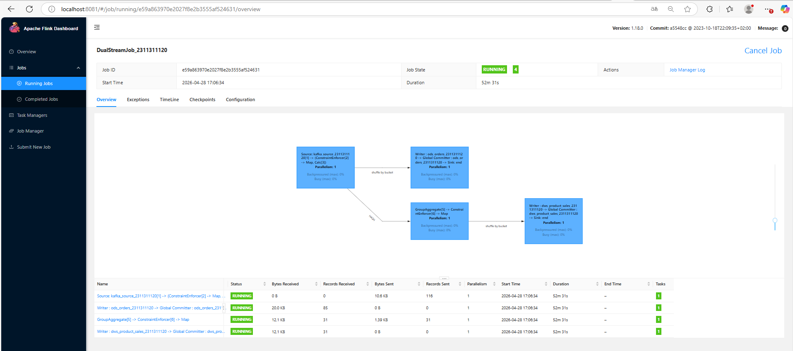
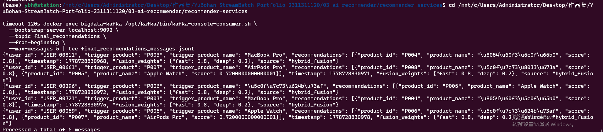

# 流批一体湖仓 AI 课程项目

[English](README.md) | [简体中文](README.zh-CN.md)

<p align="center">
  <a href="01-modern-lakehouse/screenshots/07-flink-job.png"></a>
  <a href="03-ai-recommender/screenshots/03-5-fusion-final-recommendations.png"></a>
</p>

**四个大数据课程实验，覆盖现代湖仓，流处理可靠性挑战，实时推荐和短视频审核。**

现代湖仓实验用 Docker Compose 启动 Kafka，Flink，Dinky，Paimon，MinIO 与 Spark，完整走通订单从流式采集到入湖存储再到批处理核对的链路。流处理挑战实验覆盖数据倾斜，小文件，状态膨胀，迟到数据，重复消息，Schema 演进和对象存储访问七类问题，每个都有前后对比证据。推荐实验把 Flink 实时特征与 DeepFM 模型接入融合服务，产出最终推荐结果。短视频审核实验使用 FastAPI 服务和本地视觉模型完成审核流程，并保留 Kafka 证据链路。

**状态。** 四个实验均已完成，说明，报告，截图，证据日志和代码都保留在对应目录中。

## 实验模块

| 模块 | 内容 | 主要技术 |
|---|---|---|
| [现代湖仓](01-modern-lakehouse/) | Kafka 采集，Flink 与 Dinky 处理，MinIO 与 Paimon 存储，Spark 分析 | Kafka，Flink，Dinky，MinIO，Paimon，Spark |
| [流处理挑战](02-streaming-challenges/) | 数据倾斜，小文件，状态膨胀，迟到数据，重复消息，Schema 演进和对象存储访问 | Kafka，Flink，Paimon，MinIO |
| [AI 推荐](03-ai-recommender/) | 实时行为特征和推荐服务 | Flink，Python 服务，模型 API |
| [短视频审核](04-short-video-stream-review/) | 本地视频审核和模型对比流程 | FastAPI，Kafka，本地 VLM 接口 |

每个模块保留自己的说明，报告，截图和代码，各目录 README 中给出完整运行命令。

## 运行入口

```bash
cd 01-modern-lakehouse
sudo service docker start
docker compose up -d --scale spark-worker=3
```

推荐服务与短视频审核以 Python 服务方式运行，其余命令见对应目录的 README。

## 文档入口

- [01 现代湖仓](01-modern-lakehouse/README.md)，环境搭建，运行命令与实验报告。
- [02 流处理挑战](02-streaming-challenges/README.md)，七个挑战目录及证据表和代码。
- [03 AI 推荐](03-ai-recommender/README.md)，服务结构与验证步骤。
- [04 短视频流审核](04-short-video-stream-review/README.md)，提交包与确定性回放说明。

实验材料按课程提交原样保留，第三方引擎沿用各自许可。

*Bohan Yu，大数据课程实验。*
