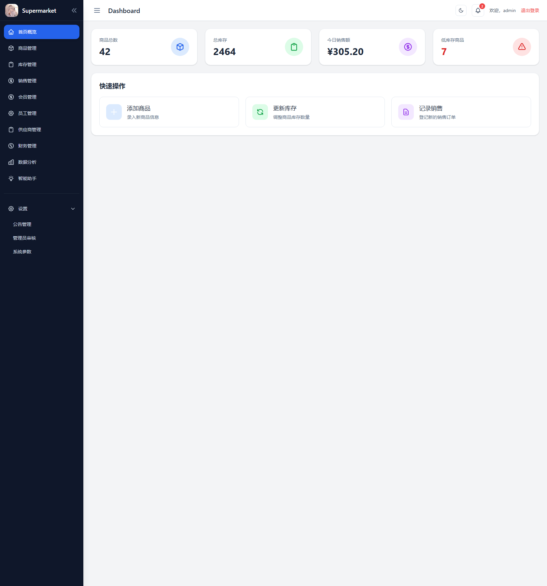
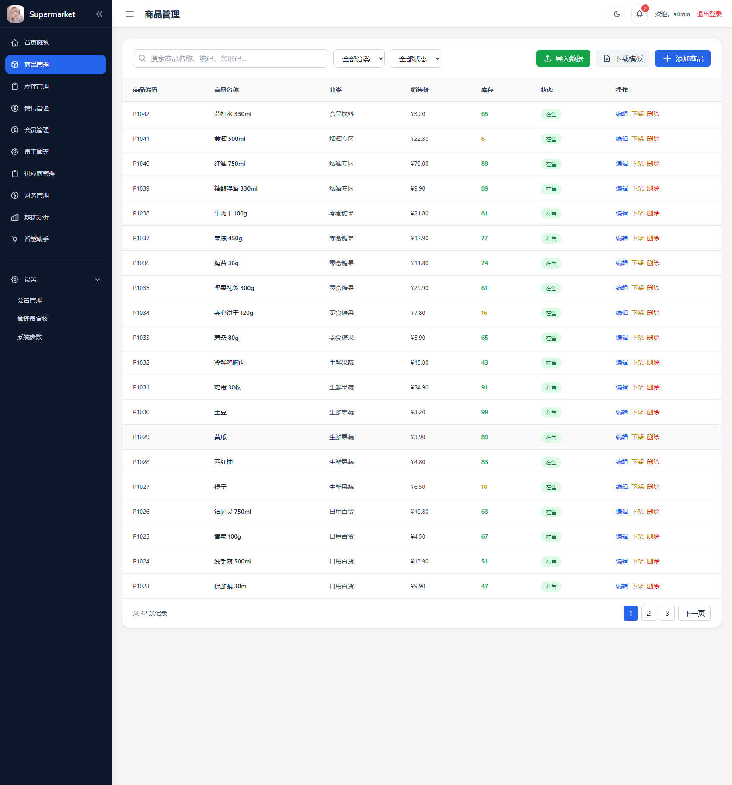

# 超市管理系统

[English](README.md) | [简体中文](README.zh-CN.md)

<p align="center">
  <a href="reports/system-analysis-design/screenshots/系统运行界面完整截图_20260614_220302/03-首页概览.png"></a>
  <a href="reports/system-analysis-design/screenshots/系统运行界面完整截图_20260614_220302/04-商品管理.png"></a>
</p>

**基于 Flask 与 SQLite 的超市门店管理系统，完整覆盖课程设计的工程要求。**

系统包含商品，库存，收银，销售，财务，公告，经营分析和智能助手，以及会员，员工，供应商和系统参数等二期模块。工程实践上使用 uv 管理依赖，pytest 测试对后端模型和二期服务保持 100% 覆盖率门槛，并提供完整的系统分析材料，包含报告，图表和答辩 PPT。

**状态。** 课程设计已完成，11 个自动化测试全部通过，覆盖率报告为 530 条语句 100%。

## 我的职责

独立完成 Flask 应用的完整实现：模型，路由，服务，模板与静态资源（`app/`），SQL 建表与种子数据（`data/`），以及带后端覆盖率门槛的 pytest 测试集（`tests/`）。完成系统分析与设计报告，报告配图与答辩 PPT（`reports/`），系统图表导出集与可编辑源文件（`supermarket-management-diagrams/`、`supermarket-management-diagrams-drawio-editable/`），以及课程交付物说明（`docs/course-deliverables/`）。

## 功能模块

- 商品管理，增删改查，上下架，CSV 与 Excel 导入，库存初始化
- 库存管理，汇总，流水台账与低库存预警
- 收银结算，商品检索，购物车结算，库存校验与销售订单生成
- 销售管理，订单列表，筛选与订单详情
- 财务管理，收支台账，日结对账，应付款与月度快照
- 经营分析，销售概览，趋势，热销商品与品类占比
- 公告管理，发布，下架，目标角色与阅读状态
- 智能助手，库存，销售，商品与帮助问答
- 会员管理，资料，等级，积分调整与账户状态
- 员工管理，资料，岗位与排班
- 供应商管理，联系人，结算周期与启停
- 系统参数，门店参数，库存预警开关与小票文案

## 快速开始

Python 3.12 或 3.13，配合 uv。

```powershell
uv sync
uv run python run.py
```

打开 `http://127.0.0.1:5000`。

默认账号

- 管理员 `admin`，密码 `admin123`
- 收银员 `cashier01`，密码 `123456`

首次启动会创建数据库表，默认用户与分类，以及二期模块的演示数据，数据库位于 `data/supermarket.db`。

## 测试

```powershell
uv run python -m compileall -q app
uv run pytest
uv run coverage run -m pytest
uv run coverage report
```

测试覆盖登录注册，商品，库存，收银，销售，财务，公告，二期主数据，错误路径和页面访问控制。

## 文档入口

- [课程交付物](docs/course-deliverables/README.md)，启动说明，需求建模，测试用例设计与答辩清单。
- [系统分析与设计报告](reports/system-analysis-design/)，最终报告，答辩 PPT 与报告配图。
- [系统图表](supermarket-management-diagrams/)，系统分析与设计 PNG 图，可编辑源文件在 [supermarket-management-diagrams-drawio-editable](supermarket-management-diagrams-drawio-editable/)。

## 目录结构

```text
app/        Flask 应用，包含模型，路由，服务，模板与静态资源
tests/      自动化测试
data/       SQL 建表，种子数据与 SQLite 数据库
docs/       课程交付物
reports/    实验报告，答辩 PPT 与报告配图
supermarket-management-diagrams/                  导出的 PNG 图表
supermarket-management-diagrams-drawio-editable/  可编辑 drawio 源文件
run.py            应用入口
config.py         应用配置
pyproject.toml    依赖，pytest 与覆盖率配置
```

数据库，演示账号和种子数据用于本地开发与课程演示。

*Bohan Yu，软件开发与管理课程设计。*
