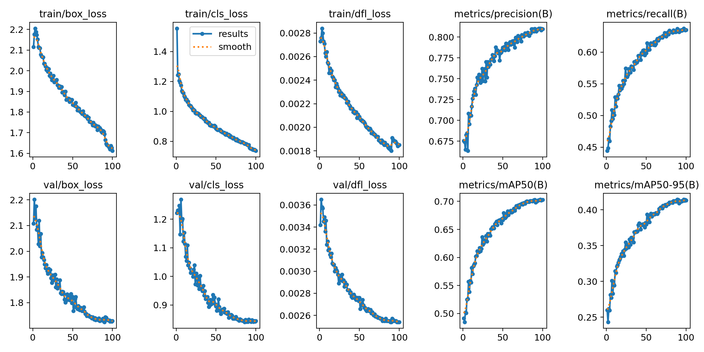
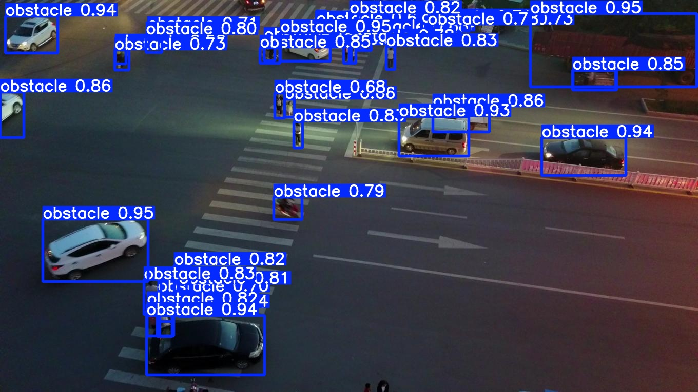

# YOLO26 + VisDrone Detection, Experiments 5 and 6

[English](README.md) | [简体中文](README.zh-CN.md)

<p align="center">
  <a href="screenshots/01_实验五_YOLO26训练过程/08_训练指标总览曲线.png"></a>
  <a href="screenshots/03_实验六_YOLO26测试预测/01_测试图片预测结果01_visdrone_train_0000072_05827_d_0000009.jpg"></a>
</p>

**Object detection with YOLO26 from Ultralytics on a VisDrone aerial subset, built for an embedded systems course design.**

The project covers the full detection workflow, from VisDrone subset preparation through label conversion, training, validation, prediction and ONNX export. Every target that can collide with a drone, pedestrians, vehicles, motorcycles and buses, merges into a single `obstacle` class, which matches the obstacle avoidance task behind the course. Training starts from `yolo26m.pt` and produces `best.pt` with curves, confusion matrices and prediction images archived under `screenshots/`.

**Status.** Experiments 5 and 6 complete. Validation over 677 images and 39961 instances scores 0.809 precision, 0.638 recall, 0.703 mAP50 and 0.415 mAP50-95. The trained model is exported to `best.onnx` and the structure is inspected in Netron.

## Pipeline

```text
VisDrone subset prep → train and val split → dataset yaml → YOLO26m training
→ validation and prediction → ONNX export → optional real video frame extraction
```

## Scripts

| Script | Step |
| --- | --- |
| `00_smoke_test_yolo26.py` | environment smoke test on the official weights |
| `05_prepare_visdrone_subset.py` | build the VisDrone subset and convert labels |
| `01_split_yolo_dataset.py` | train and val split |
| `02_make_data_yaml.py` | generate the dataset yaml |
| `03_train_yolo26.py` | train YOLO26 |
| `04_exp6_val_predict_export.py` | validate, predict and export ONNX |
| `06_extract_real_video_frames.py` | extract frames from real drone video |

## Getting Started

Python 3.10 with Ultralytics.

```bash
pip install -r requirements_yolo26.txt
python scripts/00_smoke_test_yolo26.py
```

A full experiment run follows the pipeline above.

```bash
python scripts/05_prepare_visdrone_subset.py --mode obstacle --max-images 300 --clean
python scripts/01_split_yolo_dataset.py
python scripts/02_make_data_yaml.py
python scripts/03_train_yolo26.py --model yolo26m.pt --device 0 --batch 4 --epochs 15
python scripts/04_exp6_val_predict_export.py --device 0
```

The ONNX export also runs as a standalone command.

```bash
yolo export model=runs/yolo26/train/weights/best.pt format=onnx imgsz=640 dynamic=True simplify=False
```

## What Is Inside

- `scripts/`, the pipeline above.
- `configs/`, the class list and dataset yaml files.
- `detect_test/`, VisDrone images for prediction demos.
- `screenshots/`, stage-by-stage evidence for both experiments.
- `docs/`, drone image source notes and sim-to-real camera data suggestions.
- `yolo26n.pt`, lightweight official weights kept for quick tests.

## Documentation

- [README.zh-CN.md](README.zh-CN.md), the Chinese page with the lab manual.
- [YOLO26实验五六项目详解.md](YOLO26实验五六项目详解.md), the detailed project write-up.
- [VisDrone子集_YOLO26m_标注训练推理步骤.md](VisDrone子集_YOLO26m_标注训练推理步骤.md), the VisDrone and YOLO26m step guide.

The VisDrone dataset and the Ultralytics weights keep their original terms.

*Bohan Yu, Embedded Systems course design.*
