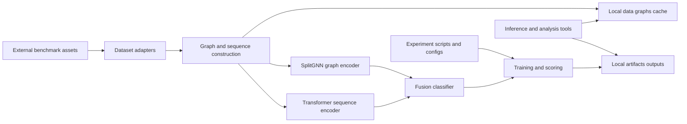

# FraudGraph ML Engineering

**Graph-and-sequence fraud detection across financial transaction datasets, packaged for deterministic experiments.**

FraudGraph ML Engineering is the research code behind a hybrid SplitGNN + Transformer fraud-detection workflow. It builds graph, relation-sequence and event-sequence views, trains a multimodal classifier and ships protocol scripts for smoke tests, ablations, tuning and reporting across eight public financial datasets.



**Status.** `v0.1.0`. The hybrid pipeline, eight dataset adapters, protocol scripts, structural tests and quality gates ship in this repository. CUDA 12.1 support ships as a pinned dependency profile.

## Highlights

- A deterministic hybrid training pipeline with graph, sequence and fusion branches.
- Dataset adapters for IEEE-CIS, Elliptic, AMLSim, credit-card fraud, DeFi, Ethereum phishing, Ethereum Ponzi and DeFi rug-pull data.
- A vendored SplitGNN encoder with attribution in [THIRD_PARTY_NOTICES.md](THIRD_PARTY_NOTICES.md).
- Dataset registry, checkpoint compatibility, inference, embedding analysis and TensorBoard auditing utilities.
- Pinned CPU and CUDA 12.1 environments with a CI quality gate on Python 3.10 and 3.12.

## Research questions

1. Which fraud signals does a heterophily-aware graph encoder capture beyond a sequence model?
2. Do relation and event sequences add stable signal beyond graph structure alone?
3. Which components remain useful as the labeled training fraction drops?

Answers come from protocol runs, each carrying a seed, dataset revision, selection rule and ablation comparison.

## Quick start

```powershell
python -m venv .venv
.\.venv\Scripts\Activate.ps1
python -m pip install -e .[dev]
python -m pip install -r requirements/requirements-cpu.txt
python scripts/validate_repository.py
python -m pytest
python -m fraud_ml_engineering --help
```

The CUDA 12.1 profile installs from `requirements/requirements-cu121.txt`. Source datasets go under `data/` following [docs/data-and-reproduction.md](docs/data-and-reproduction.md), caches under `data/graphs/` and outputs under `artifacts/`.

## Experiment workflow

```powershell
python -m fraud_ml_engineering.experiment_tools.run_splitgnn_smoke_suite --dataset comp --device cpu
python -m fraud_ml_engineering.experiment_tools.run_hybrid_mainline_protocol --help
python -m fraud_ml_engineering.experiment_tools.run_hybrid_fusion_ablation --help
python -m fraud_ml_engineering.experiment_tools.run_hybrid_low_label_mechanism_ablation --help
python -m fraud_ml_engineering.experiment_tools.run_ieee_acceptance_matrix --help
python -m fraud_ml_engineering.experiment_tools.run_ieee_splitgnn_tuning --help
```

Every operator entry point is packaged under `fraud_ml_engineering.experiment_tools` and also shipped as a thin wrapper under `scripts/` with the same CLI.

Record run provenance before long experiments with `python -m fraud_ml_engineering.experiment_tools.record_run_manifest`, documented in [docs/experiment-manifest.md](docs/experiment-manifest.md). Consolidate completed results through [docs/comparison-report-schema.md](docs/comparison-report-schema.md). Protocol details live in [docs/research-protocol.md](docs/research-protocol.md) and [docs/experiment-catalog.md](docs/experiment-catalog.md).

## Repository evidence

- Structural tests cover the CLI contract, repository contract, protocol helpers, artifact records and report validation on CPU.
- `scripts/validate_repository.py` checks required files, configuration inventory, compilation, internal imports, source hygiene and version metadata.
- GitHub Actions runs the validator, structural tests, compilation, package build and an installed-wheel CLI smoke test on Python 3.10 and 3.12.

## Quality gates

```powershell
python scripts/validate_repository.py
python -m pytest
python -m compileall -q src scripts tests
python -m build
```

GitHub Actions runs the validator, structural tests, compilation, package build and an installed-wheel CLI smoke test on Python 3.10 and 3.12. Contribution expectations live in [CONTRIBUTING.md](CONTRIBUTING.md).

## Scope

- Dataset adapters preserve dataset-specific constraints, for example Ethereum Ponzi and DeFi rug-pull tasks pair with separately sourced negative sets.
- Reported figures pair with their dataset, environment, seed and protocol artifacts.

## Documentation

- [docs/research-protocol.md](docs/research-protocol.md), scoring and provenance rules.
- [docs/experiment-catalog.md](docs/experiment-catalog.md), research questions mapped to executable protocols.
- [docs/experiment-manifest.md](docs/experiment-manifest.md) and [docs/comparison-report-schema.md](docs/comparison-report-schema.md), run provenance and report schemas.
- [docs/data-and-reproduction.md](docs/data-and-reproduction.md), dataset layout and determinism scope.

## License and attribution

Source-available under the terms in [LICENSE](LICENSE). The SplitGNN integration and external datasets carry separate provenance and usage notes in [THIRD_PARTY_NOTICES.md](THIRD_PARTY_NOTICES.md).
