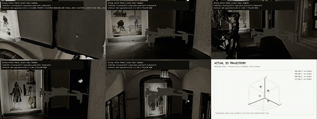

# HM3D Realised-QD 多无人机探索

<p align="center">
  
</p>

<p align="center"><em>HM3D 派生室内场景中的多无人机协作探索。</em></p>

本项目研究真实四旋翼执行约束下的 HM3D 派生三维场景无目标多无人机协作探索。多机从公共稀疏测距构建局部 belief，在共享候选池中选择安全可执行的团队计划，并且只用真实执行回执更新行为多样性和片段复用。

主任务没有人工目标点、目标数量、confirmed-recall，也没有正式 RGB-D 合同。主指标为 `Explored-Free-Flight-Volume-AUC_time`，所有方法共享 CF2X、通信、安全和物理时间合同。

英文展示入口：[README.md](README.md)。代码在 `src/aerocity_method/`，配置在 `configs/`，入口脚本在 `scripts/`，测试在 `tests/`，有效文档由 [docs/README.md](docs/README.md) 管理。

普通测试：

```powershell
uv sync --extra dev --extra rl --extra hm3d
.\.venv\Scripts\python.exe -m pytest -q -p no:cacheprovider
.\.venv\Scripts\python.exe -m ruff check src tests scripts
```

HM3D 资产、Isaac 内容、权重、私有评测数据和原始运行结果不随公开源码发布。
