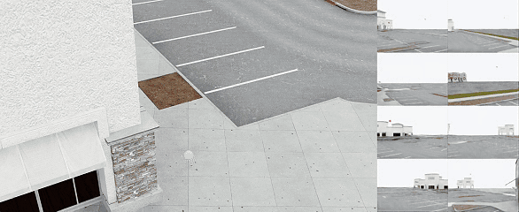

# Rivermark Benchmark

<p align="center">
  
</p>

<p align="center"><em>Multi-agent 3D search in the Rivermark benchmark.</em></p>

[English](README.md) | [简体中文](README.zh-CN.md)

**A toolchain for collecting, auditing, and evaluating native Isaac Sim data for multi-agent 3D stealth-search (Search3D) research — eight physically simulated CF2X vehicles in a procedural City-Lite scene.**

Rivermark is engineered around three goals: **reproducibility**, **data integrity**, and **cross-paradigm evaluation**. It is not a single simulation — it is a benchmark *infrastructure* that binds every capture to cryptographic contracts, audits each episode before admission, and exposes evaluation through a stable, schema-verified interface that classical planning, RL/MARL, QD, and vision-language-action (VLA) agents can all target.

---

## Design Highlights

- **Reproducibility by construction.** Every scene, protocol, runtime, and source tree is pinned by SHA-256 contracts. Episodes are seeded deterministically. A runtime lock (profile `citylite-windows-isaacsim-5.1.0.0-local-isaaclab-2.3.2`) plus CF2X calibration fixes the software stack so that captures can be re-run and compared.
- **Formal dataset admission.** Captures are rejected unless they pass provenance checks: no unbound files, no stale receipts, no split leakage, no unapproved lineage. A failure ledger and crash-left recovery make long collection runs auditable.
- **Cross-paradigm evaluation.** A single observation/action ABI serves classical planners, RL/MARL, offline RL, and VLA/LeRobot agents, with projection to RLDS, Zarr, and Parquet. The evaluator scores search episodes against reference metrics and accepts submissions through a validated, schema-checked interface.
- **Multi-sensor synchronized capture.** Online RGB, depth, semantic labels, RayCaster LiDAR, IMU, contact/safety state, body state, actions, camera extrinsics, and a fixed-world witness — captured for an 8-vehicle fleet in one pass.
- **Contract-first engineering.** 15+ JSON Schemas (`schemas/`) define every artifact; a 66-file, 411-test suite (`tests/`) runs on CPU without Isaac Sim; supply-chain and asset-provenance modules audit USD assets and dependencies (incl. CycloneDX SBOM generation).

---

## Repository Layout

```
rivermark/
├── README.md          ← this document
├── code/              ← full source, config, schemas, and CPU test suite
│   ├── src/rivermark_benchmark/   core modules (capture, validation, evaluation, reproducibility)
│   ├── config/                    collection protocols, runtime locks, label ontology
│   ├── schemas/                   JSON Schema contracts for every artifact
│   └── tests/                     CPU-runnable test suite
├── docs/              ← reader-facing design docs (overview, evaluation, reproducibility, governance, limitations)
├── media/             ← rendered overview/composite videos and key frames (8-vehicle fleet)
└── evidence/          ← same-seed repeatability reports and episode manifest examples
```

---

## Quick Start (reproducible on CPU)

Python 3.10+ required. Install the CPU dependencies, then run the researcher smoke check — it creates a small non-formal fixture, verifies it, reads public arrays, and writes a report **without starting Isaac Sim**:

```powershell
cd code
python -m pip install -e ".[cpu-ci]"
$output = Join-Path $env:TEMP 'rivermark-researcher-smoke'
python -m rivermark_benchmark.researcher_entry $output
Get-Content "$output\researcher_smoke_report.json"
```

Run the full CPU test suite:

```powershell
python -m unittest discover -s tests -v
```

---

## Reproducibility Evidence

`evidence/same-seed-repeatability*.json` report a bounded same-seed experiment: **two independent captures of the same episode seed**, compared by an analyzer (`rivermark_benchmark.repeatability`) using camera-local, frame-aligned, class-and-agent-ID semantic comparison. The claim is deliberately honest: *bounded same-seed variation, not bitwise determinism* — a realistic and measurable reproducibility statement for physics-based simulation. Every binding is pinned (protocol, runtime lock, source tree, receipt, independent validation), each by SHA-256.

- Example episode manifests are included in `evidence/` (public and evaluator-private variants).

---

## Media

`media/` contains rendered evidence from train/validation cells:

- **Overview** — `*_overview.mp4` (top-down overview of the 8-vehicle fleet)
- **Composite** — `*_composite.mp4` (synchronized multi-camera composite)
- **Key frames** — `*_first/last/25/50/75pct_frame*.png` stills of both views

Cells: `train-cell0/1/2/3/9/11`, `validation-cell13/14/15/16/17/18/19`, and `route-witness-r31` (protocol `citylite-t1-expert-coverage-v2`).

For a new multi-start native recording batch, use [the route-family video
procedure](docs/multistart-native-video-recording.md). It covers both frozen
City-Lite route families and encodes only native Isaac RGB archives.

---

## Evaluation Pipeline

The evaluator (`evaluator.py`, `search_event_evaluator.py`, `metrics.py`) scores an episode against reference search metrics and returns a validated submission report. Evaluator inputs are kept evaluator-private until admission; submissions are schema-verified before scoring. Baselines are pluggable through `baseline_harness.py`, with reference methods for classical, learned, MARL, and QD pipelines (`methods.py`, `learned.py`, `marl.py`, `qd_train.py`, `torch_train.py`).

---

## License

Rivermark-authored source code, schemas, and documentation are licensed under **Apache-2.0** (`code/LICENSE`). NVIDIA Isaac Sim, Rivermark content, CF2X USD, and third-party assets are not vendored by this repository — obtain and use them under their applicable terms.
