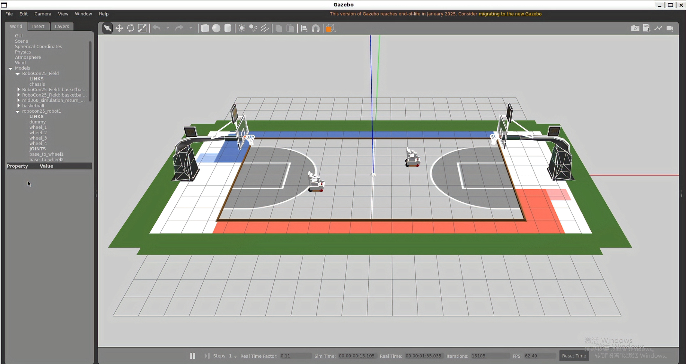
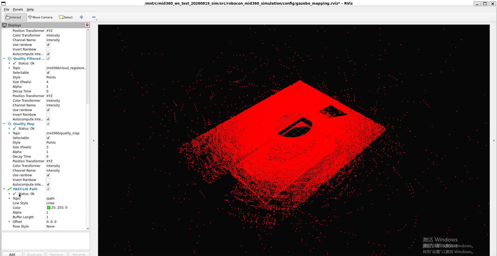
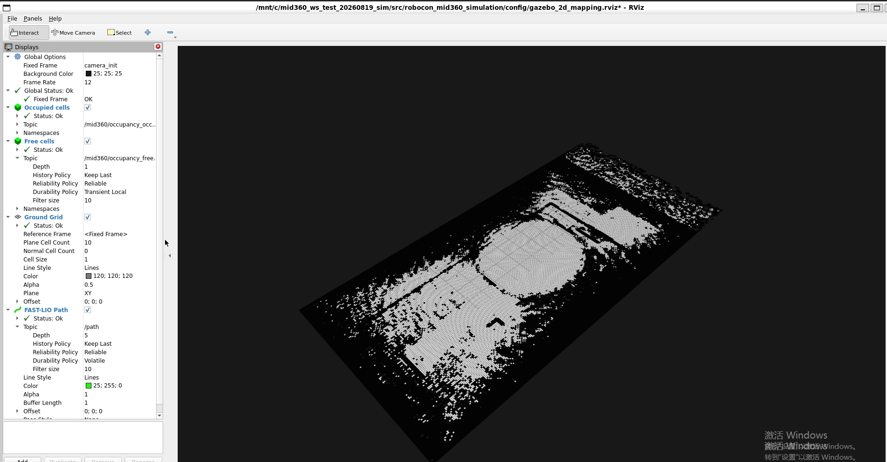
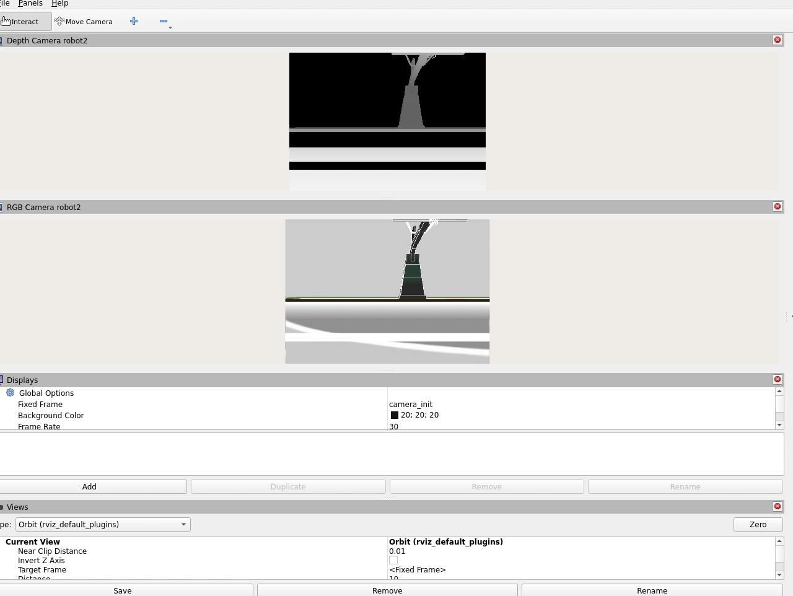
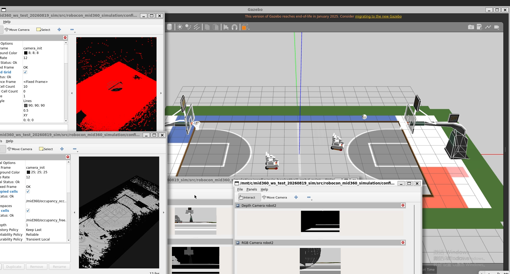

# Robocon MID-360 自主栈

**面向竞赛篮球机器人的仿真优先 ROS 2 自主系统。**

<p align="center">
  
  
</p>
<p align="center">
  
  
</p>
<p align="center">
  
</p>
<p align="center">
  
</p>

系统把 Livox MID-360 仿真，FAST-LIO2 里程计与建图，固定地图定位，感知门控，位姿指令仲裁与安全比赛总控连接在同一个 ROS 2 工作区。难点在于信任链。每一次交接都携带自己的有效性信号，从逐点 LiDAR 时间到地图锁定，目标有效性与动作反馈，无效输入会在拥有该信号的闸门处被拒绝。

**状态。** `v0.1.0-simulation-prealpha`。完整链路可在 Gazebo 仿真与回放输入上运行，感知与机构接口使用显式合成适配器。硬件步骤遵循源码树中的标定与互锁流程。

## 功能范围

- **MID-360 数据路径。** Livox `CustomMsg`，逐点时间，IMU 传输，输入校验与新鲜度诊断。
- **FAST-LIO2 集成。** 建图与局部里程计的 ROS 2 启动配置，配合受控运动脚本。
- **固定地图定位。** PCD 加载，地图元数据，扫描匹配，`map -> odom` 锚定，跟踪状态与恢复转换。
- **比赛控制。** 规则感知总控，带版本的动作请求，感知门控，协议处理与故障注入测试。
- **Gazebo 环境。** 候选室内比赛场景，开放场地退化场景，场地几何，机器人模型，篮筐与仿真 MID-360 传感器。
- **确定性实验。** 一键调度器，运行清单，确定性 ROS 域隔离，指标导出与绘图工具。

## 数据链路

```text
Gazebo 或录制包
        |
        v
Livox CustomMsg + IMU  ->  FAST-LIO2  ->  局部里程计
                                            |
                                            v
                               配准点云建图
                                            |
                              冻结 PCD 与元数据
                                            |
                                            v
                          扫描到地图定位
                                            |
                                            v
             感知门控 -> 动作仲裁 -> 比赛总控
```

公开 TF 契约是链路 `map -> odom -> base_link -> imu_link -> lidar_mid360`。每个接口都显式，可测试且可替换，控制层把定位新鲜度，地图锁定，感知有效性，动作反馈，心跳，过期，取消与恢复作为一等状态。

## 快速开始

支持环境是 Ubuntu 22.04 与 ROS 2 Humble。

```bash
source /opt/ros/humble/setup.bash
export LIVOX_SDK2_ROOT=/path/to/Livox-SDK2/install
colcon build --symlink-install --cmake-args -DLIVOX_SDK2_ROOT="$LIVOX_SDK2_ROOT"
source install/setup.bash
```

查看启动参数并运行依赖轻量验证套件。

```bash
ros2 launch robocon_mid360_simulation gazebo_mid360_lio.launch.py --show-args
python3 tools/validate_project.py
python3 tools/run_python_contract_tests.py
```

一条命令运行有界实验组。

```bash
bash tools/run_experiments.sh --dry-run all
bash tools/run_experiments.sh quality
bash tools/run_experiments.sh faults
bash tools/run_experiments.sh rgbd
```

可见的 Gazebo 与 RViz 会话。

```bash
bash tools/run_experiments.sh gui
```

调度器会创建隔离运行目录，记录确切命令与 ROS 域，并把生成的证据放在公开源码之外。

## 运行配置

| 配置 | 用途 |
| --- | --- |
| `30000-ray` | 用于受控建图与 LIO 实验的全密度 Gazebo 传感器配置 |
| `2000-ray` | 快速话题与接口冒烟配置 |
| `indoor_competition_candidate` | 带场地几何与四个篮筐资产的结构化室内场景 |
| `open_field_degraded` | 质量门控与几何退化测试 |
| `gazebo_simulation` | Gazebo 传感器与物理运行 |
| `bag_replay` | 回放录制输入 |

## 验证

CI 运行 Python 契约测试，校验 ROS 包清单，安装 ROS 依赖，构建接口与控制包并执行 ROS 测试套件。本地运行使用相同命令。

```bash
colcon test --event-handlers console_direct+
colcon test-result --verbose
```

附加工具可从保留的 JSON 与 CSV 数据导出运行摘要与图表。

```bash
python3 tools/export_run_metrics.py <run-directory> <output-directory>
python3 tools/plot_run_metrics.py <metrics.csv> <output-directory>
```

## 仓库结构

```text
src/
  mid360_localization_contract/  输入，坐标框，跟踪与地图契约
  mid360_map_localizer/          固定地图扫描匹配器
  mid360_map_tools/              配准点云建图与占据栅格工具
  robocon_game_supervisor/       比赛状态机与安全门
  robocon_perception_adapter/    目标有效性与感知接口
  robocon_camera_yolo_adapter/   检测器接口与指标计分
  robocon_pose_command_bridge/   位姿到指令仲裁接口
  robocon_mid360_simulation/     Gazebo 世界，机器人，传感器与运行脚本
  vendor_fast_lio/               FAST-LIO2 源码与许可声明
  vendor_livox_ros_driver2/      Livox ROS 2 驱动与许可声明
tools/                           验证，回放，指标与绘图工具
site/                            GitHub Pages 作品站点
.github/workflows/               持续集成与 Pages 部署
```

私有运行归档，生成地图，数据包，内部审计与开发笔记本留在公开源码树之外，由 Git 忽略。

## 文档

- [MID-360 接口契约](src/mid360_localization_contract/INTERFACE_CONTRACT.md) 覆盖坐标框，话题，诊断，QoS 与定时。
- [作品站点](site/index.html) 展示架构与有序的 2025 ROBOCON 视图。
- `src/` 下的上游声明记录每个改编包的来源仓库，版本与改动范围。

## 署名

第三方组件保留在源码位置并附带原始许可与声明。改编包包含 `UPSTREAM_NOTICE.md`，说明来源仓库，版本与改动范围。再分发修改版本前请阅读 `src/` 下的声明。

## 作品站点

**https://yubohann.github.io/Robocon-mid360-autonomy-stack/**

## 许可

团队自有文件遵循仓库许可 [LICENSE](LICENSE)。内置组件保留各自许可与声明。
