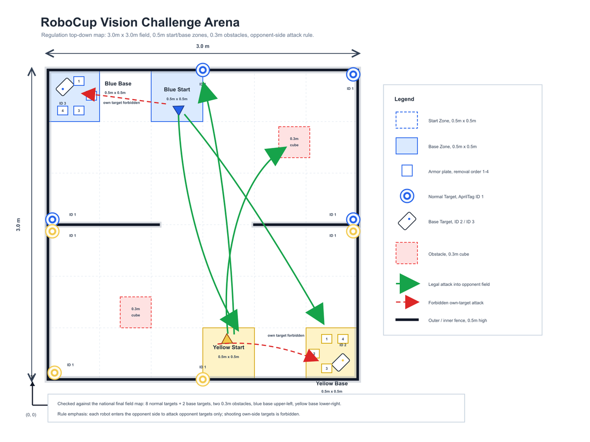

# RoboCup CBG-WM

<p align="center">
  
</p>

<p align="center">
  <a href="./docs/media/最终回放_三视角同步拼接版.gif">
    
  </a>
</p>

<p align="center">
  <a href="./docs/media/large_scale_50v50_isaaclab_replay.mp4">完整 IsaacLab 回放 MP4</a>，
  <a href="./docs/media/README.md">媒体说明</a>
</p>

**面向规则约束多机器人对抗战术的不确定性 belief graph 世界模型，基于 ROS 2 与 IsaacLab 构建。**

CBG-WM 是一个面向 RoboCup 风格对抗比赛的机器人研究作品。两台差速机器人在 3 米乘 3 米场地中寻找对方目标，通过激光距离与驻留门限射击，推动刚性红色箱体，并按顺序打开基地护甲。难点在于规则约束下的战术决策。遮挡后的检测会变旧，可移动箱体改变视线，护甲状态决定哪些基地射击合法，裁判事件会改写目标存在状态。CBG-WM 为每个对象维护带类型的 belief token，用随机集成预测交互动力学，并按低尾风险对联合 Flow 候选排序，再交由几何感知屏蔽执行首个动作。

**状态。** `v0.1.0` 研究作品。已验证主线是双机对抗，包含 128 回合计分运行，8 回合严格回放审计，三视角 IsaacLab 媒体与 1v1 实机实验记录。50v50 规则基准是仿真阶段扩展。

## 已核验证据

### 双机对抗

128 回合随机计分运行显示双方平衡且接触干净。

| 指标 | 数值 |
| --- | ---: |
| 回合数 | 128 |
| 黄方胜率 | 49.22% |
| 蓝方胜率 | 50.78% |
| 平局率 | 0.00% |
| 静态穿透 | 0 |
| 箱体穿透 | 0 |
| 每局机器人接触 | 0.00 |

严格回放审计逐步重放选中检查点并核对规则与物理不变量。8 个回合给出黄方 37.50% 胜率，蓝方 62.50% 胜率，零硬性违规，零己方目标处罚，每回合 1.0000 次基地获胜。

### 大规模 50v50 扩展

扩展训练从 5v5 到 10v10 到 25v25 到 50v50 的分阶段课程，并对最终阶段进行 256 局计分，每方 50 台车辆，场地 80 米乘 50 米。接受的轨迹在 IsaacLab 中以 100 个车辆形状角色回放。

| 指标 | 数值 |
| --- | ---: |
| 最终阶段训练回合 | 12000 |
| 计分回合 | 256 |
| 黄方胜率 | 36.72% |
| 蓝方胜率 | 42.19% |
| 平局率 | 21.09% |
| 黄方基地伤害 | 44.90 |
| 蓝方基地伤害 | 44.89 |
| 机器人接触均值与 P95 | 0.00 与 0.00 |
| 障碍接触 | 0.00 |

[50v50 IsaacLab 回放 MP4](docs/media/large_scale_50v50_isaaclab_replay.mp4)


### 运行栈

ROS 2 Jazzy 工作区包含 `rcvrl_bringup`，`rcvrl_behavior`，`rcvrl_vision`，`rcvrl_navigation`，`rcvrl_motion`，`rcvrl_shooter`，`rcvrl_description` 与 `rcvrl_interfaces`。Nav2 负责导航，`slam_toolbox` 负责建图，`rcvrl_vision` 检测 AprilTag Tag36h11 目标，射击指令经 ROS 2 服务并在对方目标安全门之后执行。

[RoboCup VisionRL 运行演示视频](https://www.bilibili.com/video/BV1Pj9ZBKEc8/?spm_id_from=333.1387.list.card_archive.click&vd_source=f79b94dd69d0c8d08ee5c3400b69d46d)

## 模型内部

- 带类型的 belief token 携带位姿，速度，属性，尺寸，可见性，年龄与协方差。被遮挡对象保留上一次 belief 并累积不确定性。
- 类型化交互图覆盖观测，接触，路线阻挡，基地保护，威胁，邻近与视线，并在 token 置换下保持等变。
- 随机集成预测状态增量，奖励，终止与四条规则风险通道，分别是机器人碰撞，受阻运动，非法射击与视线违规。
- Flow 候选 CVaR MPC 按低尾回报，预测规则风险与集成分歧对联合候选序列排序，再通过既有动作屏蔽执行首个动作。

方法说明见 [CBG-WM](docs/cbg_wm.md)。


## 平台





## 快速开始

规则环境与测试需要 Python 3.10 或更高版本。

```bash
python -m pip install -e ".[dev]"
python -m pytest tests -q
```

可选的训练与渲染依赖。

```bash
python -m pip install -e ".[training]"
```

Ubuntu 24.04 与 ROS 2 Jazzy 上的工作区构建。

```bash
cd crc_robocup_vision_ws
rosdep install --from-paths src --ignore-src -r -y
colcon build --symlink-install
source install/setup.bash
ros2 launch rcvrl_bringup competition.launch.py
```

无硬件启动冒烟检查。

```bash
ros2 launch rcvrl_bringup competition.launch.py start_navigation:=false shooter_dry_run:=true auto_start:=false
```

黄方与蓝方淘汰赛启动会各自选择阵营与路线文件。

```bash
ros2 launch rcvrl_bringup competition.launch.py team_color:=yellow target_file:=$(ros2 pkg prefix rcvrl_navigation)/share/rcvrl_navigation/config/targets.elimination.yellow.yaml
ros2 launch rcvrl_bringup competition.launch.py team_color:=blue target_file:=$(ros2 pkg prefix rcvrl_navigation)/share/rcvrl_navigation/config/targets.elimination.blue.yaml
```

ROSIDL 生成需要 ASCII 构建路径，WSL 用户先把工作区复制到原生 Linux 路径。

规则环境冒烟运行。

```bash
python -m pip install -r isaaclab_sim/rl/requirements.txt
cd isaaclab_sim/rl
python evaluate_selfplay.py --episodes 8
```

Windows 上的 IsaacLab 预览通过项目包装脚本运行，Kit 配置，日志，pip 环境与扩展缓存都放在项目内的 `.isaaclab_runtime/`。

```powershell
.\scripts\run_isaaclab_project.ps1 -Headless -DemoFlow -Duration 120
```

查看或停止本项目的 IsaacLab 进程。

```powershell
.\scripts\stop_project_isaaclab.ps1 -WhatIfOnly
.\scripts\stop_project_isaaclab.ps1
```

## 文档

- [快速开始](docs/getting_started.md) 覆盖 Python，ROS 2 与 IsaacLab 环境，快速演示与常见问题。
- [能力与实测证据](docs/capabilities.md) 列出已验证范围与公开指标。
- [架构](docs/architecture.md) 覆盖运行图，包结构，话题与比赛状态机。
- [CBG-WM 方法](docs/cbg_wm.md) 覆盖 belief token，图动力学，训练与计分命令。
- [回放指南](docs/reproducibility.md) 列出冒烟测试，计分，导出与回放命令。
- [比赛规则](docs/rules_summary.md) 汇总规则门使用的 2025 公开规则。
- [Sim2Real](docs/sim2real.md) 记录标定，域随机化与部署验证阶梯。
- [申请项目简介](docs/admissions_project_brief.md) 是面向审阅者的简短总结。

## 许可

仓库自有代码与文档遵循 [LICENSE](LICENSE)。第三方依赖与网格模型按各自条款处理，清单见 [THIRD_PARTY_NOTICES.md](THIRD_PARTY_NOTICES.md)。
