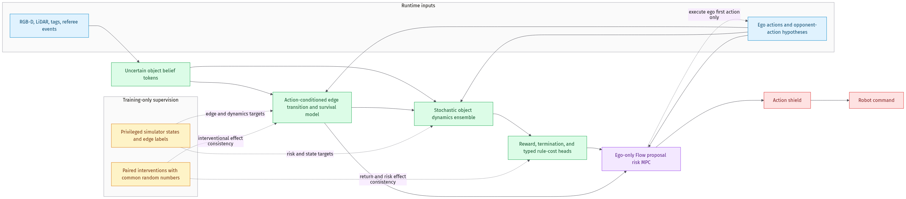

# CBG-WM

CBG-WM is the uncertainty-aware planning path for the two-robot tactical environment.

> Uncertainty-Aware Counterfactual Belief-Graph World Model for Rule-Constrained Multi-Robot Tactics

It addresses a narrower question than generic video prediction. Can a robot use short-horizon object-interaction rollouts when detections are stale or occluded, boxes alter routes and line of sight, and removing armor changes access to a base, while explicitly accounting for collision and rule risk?

## Implemented architecture



1. `BeliefTracker` converts simulated detections to a fixed set of typed belief tokens. Each token contains pose, velocity, type-specific attributes, extent, visibility, last-seen time, observation age, covariance, occlusion and presence. Occluded objects retain their last belief and accumulate uncertainty. Fixed target and armor geometry may enter as a high-covariance field-map prior, and movable boxes require observation. Referee and hit events synchronize target and armor presence even when geometry is occluded. The planner consumes belief tokens as its state representation.
2. `build_typed_edges` constructs sparse relations for observation, contact, route blocking, base protection, threats, proximity and line of sight. The construction and graph dynamics are equivariant when tokens and their type labels are permuted together.
3. `CounterfactualBeliefGraphWorldModel` separates per-object self dynamics from typed interaction messages. Each ensemble member predicts Gaussian state deltas, reward distributions, termination, visibility and presence and four rule-risk channels.
4. `FlowProposalRiskMPC` uses the existing Flow actors as a trajectory prior. It scores joint candidate sequences by lower-tail CVaR return, predicted rule risk and ensemble disagreement, executes only the first action, and then applies the existing expert composition and action shield.

The four learned risk channels are robot and target collision, blocked motion or penetration, illegal or own-target fire, and line-of-sight and range violation.

## Source map

- `isaaclab_sim/rl/world_model/belief_graph.py` defines the token schema, sensor belief tracker, typed graph and rule labels.
- `isaaclab_sim/rl/world_model/cbg_world_model.py` implements typed message passing, the stochastic ensemble, loss and multi-step rollout.
- `isaaclab_sim/rl/planning/risk_mpc.py` implements Flow proposals, CVaR scoring and receding-horizon action selection.
- `isaaclab_sim/rl/train_world_model_sacflow_selfplay.py` covers replay collection, ensemble training, the MPC action path and checkpoint fields.
- `isaaclab_sim/rl/evaluate_cbg_world_model.py` covers prediction, calibration, OOD and intervention scoring.
- `isaaclab_sim/rl/configs/cbg_wm_ablations.yaml` holds the required ablation matrix.

## Training

```bash
python isaaclab_sim/rl/train_world_model_sacflow_selfplay.py \
  --config configs/world_model_flow.yaml \
  --output ../output/rl/cbg_wm_seed260707
```

The CLI exposes paired boolean flags. For example, `--no-mpc-enabled` produces the no-MPC ablation. `--graph-layers 0` removes interaction message passing, and `--ensemble-size 1 --uncertainty-coef 0` produces the single-model ablation.

The saved checkpoint uses algorithm ID `cbg_wm_sac_flow_selfplay`. Legacy `object_centric_world_model_sac_flow_selfplay` checkpoints remain accepted by the actor scoring and export tools.

## Scoring

Run the nominal multi-step and calibration scoring.

```bash
python isaaclab_sim/rl/evaluate_cbg_world_model.py \
  --checkpoint isaaclab_sim/output/rl/cbg_wm_seed260707/policy.pt \
  --scenario nominal \
  --episodes 8 \
  --output ../output/eval/cbg_wm_nominal.json
```

Repeat with `held_out_boxes`, `held_out_target_yaw`, `delayed_occlusion`, `low_friction`, and `aggressive_opponent`. The output fields cover the following items.

- 1, 5 and 10-step physical and position RMSE.
- epistemic and aleatoric variance.
- per-risk Brier score, ECE and AUROC when both classes occur.
- upper-tail CVaR rule risk.
- win rate and scores in the selected OOD scenario.
- model intervention deltas between push and no-push states and between armor-present and armor-removed states, plus a paired simulator-geometry check of the predicted direction.

Real-robot scoring uses the same token contract from ROS detections and reports task success and rule events separately. Sim2Real performance is measured on hardware through that contract.

## Experimental contract

Use at least three seeds and the variants in `configs/cbg_wm_ablations.yaml`. A valid comparison reports multi-step error, calibration, CVaR risk, OOD task outcome, and runtime.

For each counterfactual pair, compare both the predicted direction and the realized environment outcome.

- keep the box in place, then move it out of the route or shot segment.
- keep the armor blocker in place, then remove it before approaching the base.

The code implements state interventions, measures their predicted consequences, and checks whether the graph-change direction matches a paired simulator geometry intervention. This establishes counterfactual sensitivity and directional consistency. The AAAI-26 STICA paper likewise defines its causality mechanism as token-level dependency.

## Design provenance

- FIOC-WM at NeurIPS 2025 motivates separating self transition from sparse object-interaction transition.
- STICA at AAAI 2026 motivates token-level dynamics and task-relevant object dependencies, with causality held at the token-dependency level.
- LPWM contributes the practical pattern of predicting object and particle means and log variances.
- Gamma-World contributes permutation-symmetric agent treatment and sparse cross-agent communication.
- TD-MPC2 contributes policy-prior candidate trajectories and short-horizon learned-model planning organization.
